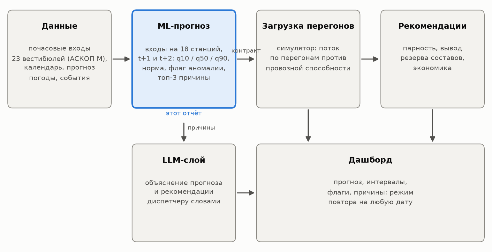
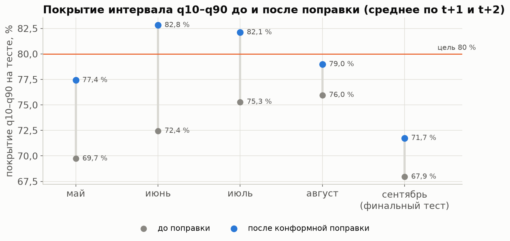
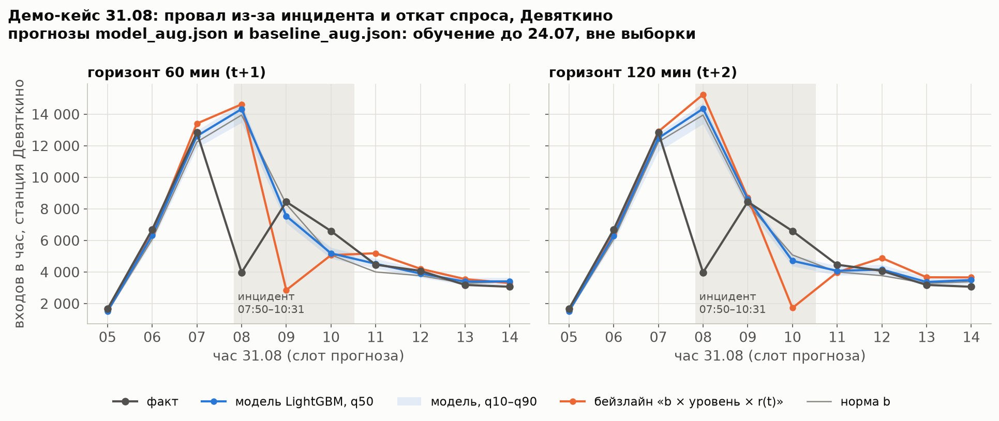
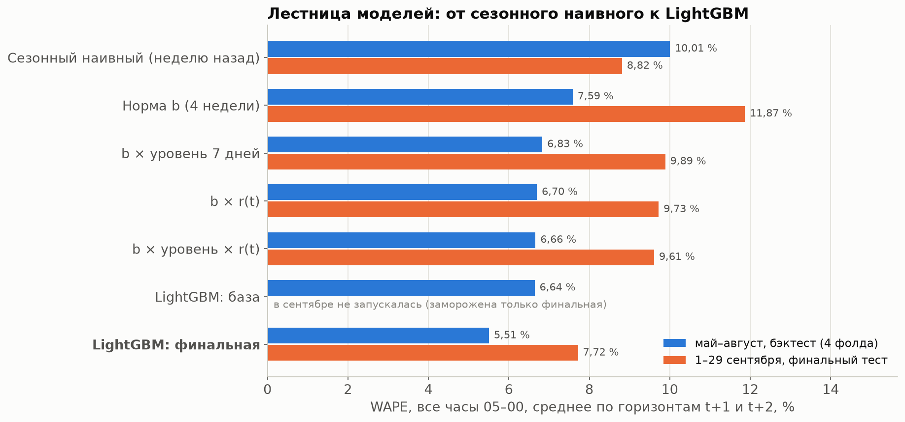

# Сценарий презентации на 5 минут

**Формат.** 9 слайдов. У каждого слайда: заголовок, крупные пункты (3–5), картинка из `reports/figures/`
и текст «что говорить вслух». Весь текст вслух — около 650 слов, примерно 5 минут при спокойном темпе.
Ключевой слайд — седьмой, демо 31.08: на него уходит минута.

| № | Слайд | Время |
|:--:|:---------------------------------------------|------:|
| 1 | Прогноз входов на станции метро | 20 с |
| 2 | Проблема: резерв выходит за 15–20 минут | 30 с |
| 3 | Данные и ловушки | 35 с |
| 4 | Главная идея: отклонение держится 2–3 часа | 35 с |
| 5 | Как работает модель | 40 с |
| 6 | Честная проверка | 35 с |
| 7 | **Результат и демо 31.08** | 60 с |
| 8 | Слабые места и что дальше | 30 с |
| 9 | Итог | 15 с |
| | **Всего** | **5 мин** |

**Если времени мало:** слайды 2 и 6 можно сократить до одной фразы, слайд 7 не сокращать.

## Слайд 1. Прогноз входов на станции метро на 1–2 часа вперёд

**На слайде:**

- 1 линия метро СПб, 18 станций;
- прогноз каждые 30 минут (стекинг, по умолчанию в продукте) и каждый час (часовая модель): медиана и интервал
  q10–q90, норма, флаг аномалии, три причины;
- ML стоит в начале цепочки: симулятор → рекомендации → дашборд.

**Картинка:** `docs/report/figures/fig_system.png` — схема системы.

{width=82%}

> **Говорить вслух (20 с).** Мы прогнозируем, сколько людей войдёт на каждую станцию первой линии в ближайшие один и два
> часа. Прогноз получает симулятор загрузки, потом рекомендации по составам и дашборд, так что от его точности зависит
> вся цепочка.

## Слайд 2. Проблема: резерв выходит за 15–20 минут

**На слайде:**

- резервный состав выходит на линию за 15–20 минут;
- полный оборот — 99 минут, в резерве 4 состава, парность до 32 пар в час;
- нужно знать поток заранее: на 1–2 часа вперёд;
- дальше смотреть не имеет смысла: отклонение от нормы живёт 2–3 часа.

**Картинка:** `reports/figures/spb_01_profiles.png` — суточные профили: у спальных станций утренний пик, у центра вечерний.

{width=85%}

> **Говорить вслух (30 с).** Резервный состав выходит на линию за 15–20 минут, полный оборот занимает 99 минут, в резерве
> четыре состава. Чтобы вовремя добавить поезда, нужно знать поток заранее. Поэтому горизонт — один и два часа: короче
> поздно, а длиннее прогноз теряет ценность, потому что отклонение от нормы живёт два–три часа.

## Слайд 3. Данные и ловушки

**На слайде:**

- 23 вестибюля × 6 528 ч = 150 144 строки, 164 876 717 входов;
- ловушка 1: даты — текст, строки в перепутанном порядке;
- ловушка 2: часы 00–02 подписаны датой прошедших суток (доказали тремя признаками);
- ловушка 3: режимы закрытия вестибюлей, инцидент 31.08, закрытия входа в пик.

**Картинка:** `reports/figures/spb_07_incident.png` — инцидент 31.08 по вестибюлям.

{width=85%}

> **Говорить вслух (35 с).** Организаторы дали почасовые входы по 23 вестибюлям за девять месяцев; пока их не было, мы
> отладили конвейер на открытых данных метро другого города. В реальных данных были ловушки: даты шли текстом в
> перепутанном порядке; часы с полуночи до двух подписаны датой прошедших суток, и мы доказали это тремя независимыми
> признаками; вестибюли закрываются по режиму; плюс инцидент 31 августа. Каждую ловушку учли флагом и всё пересчитали.

## Слайд 4. Главная идея: отклонение от нормы держится 2–3 часа

**На слайде:**

- норма — «сколько обычно в этот час»; отклонение r = факт / норма;
- корреляция отклонения с лагом 1 / 2 / 3 часа: 0,72 / 0,59 / 0,44;
- после часа с r > 1,15 такое же отклонение остаётся в 50 % следующих часов (в среднем — 11 %);
- «норма × текущее отклонение»: ошибка 8,53 → 6,74 %.

**Картинка:** `reports/figures/spb_08_persistence.png` — три панели: лаги, распределение после r > 1,15, связь утра с вечером.

{width=100%}

> **Говорить вслух (35 с).** Главная идея простая: если в этот час людей больше обычного, то и в ближайшие два–три часа их
> будет больше. Корреляция с лагом в час — 0,72, в три часа — 0,44. После часа с отклонением больше 15 % такое же отклонение
> остаётся в половине следующих часов, а в среднем — только в 11 %. Даже простое правило «норма на текущее отклонение»
> снижает ошибку с 8,5 до 6,7 %.

## Слайд 5. Как работает модель

**На слайде:**

- норма = медиана того же часа за 4 последних таких же дня × поправка на уровень недели;
- модель учит отклонение от нормы, а не сам поток;
- три LightGBM: q10, q50, q90; 26 признаков: последний час, вся линия, соседи, вчера, дождь;
- интервал калибруем: покрытие 73,4 % → 80,3 %.

**Картинка:** `docs/report/figures/fig_calibration.png` — покрытие интервала до и после поправки.

{width=80%}

> **Говорить вслух (40 с).** Норма — медиана того же часа за четыре последних таких же дня с поправкой на уровень недели.
> Модель учит не сам поток, а отклонение от нормы. Три модели LightGBM дают нижнюю границу, медиану и верхнюю границу;
> на входе 26 признаков: последний час, вся линия, соседи, вчера и дождь. Сырой интервал был узким — покрывал 73 % вместо
> 80. Конформная калибровка подняла покрытие до 80,3 %.

## Слайд 6. Честная проверка

**На слайде:**

- бэктест на 4 месяцах: расширяющееся окно, зазор 7 суток;
- сентябрь закрыт от любого кода, открыт один раз;
- заморозка: хэши конфигурации и кода, тег `freeze-before-final`;
- тесты на утечку: поток после момента прогноза не меняет признаки.

**Картинка:** `docs/report/figures/fig_folds.png` — фолды, зазор и закрытый сентябрь.

{width=88%}

> **Говорить вслух (35 с).** Проверка идёт вперёд по времени: четыре месяца с расширяющимся окном и неделей зазора.
> Сентябрь был закрыт от любого кода. Модель заморозили с хэшами конфигурации и кода, поставили тег — и только потом
> запустили тест, ровно один раз. Утечку проверяют тесты: если обрезать поток после момента прогноза, признаки не меняются.

## Слайд 7. Результат и демо 31.08 (ключевой)

**На слайде:**

- **31.08:** на Девяткино в 08 ч вошло 3 969 при норме 13 942 (инцидент на «Чернышевской»);
- прогноз на 09 ч в 08:59: простое правило — 2 849, **модель — 7 545**, факт — 8 445, норма — 8 295;
- модель поняла, что такой провал не держится; сам провал не предсказывает никто;
- итог: 5,51 против 6,66 % (бэктест) и 7,72 против 9,61 % (закрытый сентябрь).

**Картинка:** `reports/figures/spb_15_demo_0831.png` — станция Девяткино, прогнозы на 1 и 2 часа; оранжевая линия —
простое правило, синяя — модель. Вторая картинка — лестница WAPE `spb_14_wape_ladder.png`.

{width=100%}

{width=70%}

> **Говорить вслух (60 с).** Ключевой пример — 31 августа. На «Девяткино» в восемь утра из-за остановки на «Чернышевской»
> вошло 3 969 человек при норме почти 14 тысяч. В 08:59 мы прогнозируем девять часов. Простое правило переносит провал
> вперёд: 2 849. Наша модель, обученная до 24 июля, то есть не видевшая этот день, даёт 7 545 при факте 8 445. Она выучила,
> что такой провал вместе с провалом всей линии не держится. Сам провал в восемь часов не предсказывает никто, и откат
> вышел выше нашего интервала — это мы честно показываем. Итог по метрикам: 5,51 процента против 6,66 на бэктесте
> и 7,72 против 9,61 в закрытом сентябре.

*Примечание для себя.* График построен моделью фолда «август» (обучена до 24.07): 7 545. В режиме повтора
(`python -m src.serve --now "2026-08-31 08:59"`) отвечает `lgbm_holdout` (обучена по 24.08): 7 178 [6 910; 7 552]. Если жюри
спросит про расхождение — это одна конфигурация на разной длине истории; правило и факт те же. Стекинг для 31.08 не отвечает:
за август нет 15-минутных данных, и `serve` сам отдаёт часовую LightGBM.

## Слайд 8. Слабые места и что дальше

**На слайде:**

- аномальные часы: 17,95 % у модели против 16,43 % у простого правила;
- интервал в сентябре покрыл 71,7 % вместо 80 %; флаг тревог шумный (F1 0,32 на бэктесте);
- стекинг с нейросетью GRU включили в продукт: в среднем +0,05 п. п. (на мае незначимо), но в аномальных часах +0,56 п. п.
  и интервал честнее (78,5 % против 69 %) — осознанный компромисс;
- дальше: 10-минутные данные, скользящая калибровка, стекинг на большем объёме данных.

**Картинка:** `reports/figures/spb_17_wape_horizon.png` — WAPE получасовых прогнозов: стекинг против частей.

{width=100%}

> **Говорить вслух (30 с).** Слабые места мы измерили. В аномальных часах модель хуже простого правила: 17,95 процента
> против 16,43. Интервал на сдвиге уровня в сентябре покрыл 72 процента вместо 80. Флаг тревог шумный. Ещё мы проверили
> ансамбль с нейросетью: в среднем он лучше всего на 0,05 пункта, но в аномальных часах — на 0,56, и интервал честнее.
> Поэтому команда включила его в продукт, хотя наше же правило на мае не выполнено, — это осознанный компромисс. Дальше —
> десятиминутные данные и скользящая калибровка.

## Слайд 9. Итог

**На слайде:**

- модель точнее лучшего простого правила на 1,16 п. п. (бэктест) и 1,89 п. п. (сентябрь), p < 0,001;
- проверка честная: сентябрь закрыт, модель заморожена, тест один раз;
- слабые места известны и измерены;
- результат передан команде по общему контракту: код — в `main`, веса моделей — архивом, инструкция — в README.

**Картинка:** не нужна — оставить на экране таблицу с главными цифрами.

> **Говорить вслух (15 с).** Итог: модель точнее лучшего простого правила на 1,16 и на 1,89 процентного пункта, проверена
> честно и заморожена, а слабые места известны и измерены. Готовы к вопросам.
