# Резюме {#sec:summary}

**Задача.** На хакатоне НТУ «Сириус» компания «Метро» предложила кейс про управление насыщенностью линии подвижным
составом в зависимости от пассажиропотока (вектор 2). Наша команда строит систему из четырёх частей:

- внешние данные и LLM-слой;
- прогноз пассажиропотока (ML — этот отчёт);
- дашборд и симулятор загрузки;
- рекомендации и экономика.

ML-часть прогнозирует входы на каждую из 18 станций 1 линии на час и на два часа вперёд. Прогноз делается в конце
каждого часа и состоит из медианы и интервала q10–q90, нормы для этого часа, флага аномалии и трёх причин прогноза
словами для LLM-слоя.

**Данные.** Основа — почасовые входы по 23 вестибюлям 1 линии за 01.01–29.09.2026 от организаторов:

- 150 144 строки после очистки;
- 164 876 717 входов.

К ним добавлены:

- производственный календарь;
- исторический прогноз погоды Open-Meteo;
- справочник событий.

Пока реальных данных не было, методы отрабатывались на открытых данных MTA, линия 7 Нью-Йорка. Код загрузки, очистки,
контракта и разведочного анализа оттуда переиспользован.

**Подход.** Сначала строится норма — медиана того же часа за 4 последних обычных таких же дня с поправкой на уровень
последней недели. Модель учит не сам поток, а его отклонение от нормы:

- три квантильных бустера LightGBM на 26 признаках;
- признаки — только по данным до момента прогноза;
- интервал откалиброван конформной поправкой.

Качество проверяли бэктестом на мае–августе: обучение расширяющимся окном, неделя зазора перед каждым тестом. Затем
провели финальный тест на сентябре — один раз, после заморозки модели с хэшами конфигурации и кода.

| | Бэктест, май–август | Финальный тест, 1–29 сентября |
|:---------------------------------------------|------------------:|------------------:|
| Норма b (медиана 4 недель) | 7,59 % | 11,87 % |
| Лучший простой прогноз «b × уровень × r(t)» | 6,66 % | 9,61 % |
| **LightGBM, финальная модель** | **5,51 %** | **7,72 %** |
| Выигрыш у лучшего простого, п. п. [95 % ДИ] | +1,16 [+1,02; +1,30] | +1,89 [+1,57; +2,24] |
| Часы пик 07–09 и 17–19: модель / простой | 4,50 % / 5,74 % | 7,13 % / 9,11 % |
| Покрытие интервала q10–q90 (цель 80 %) | 80,3 % | 71,7 % |

: Главные результаты. WAPE по всем часам 05–00, среднее по прогнозам на 1 и 2 часа {#tbl:summary}

**Главные выводы.**

1. **Самый сильный сигнал — насколько сегодня поток отличается от нормы.** Отклонение держится 2–3 часа. Группа
   признаков «ядро динамики» дала основной выигрыш абляции: +0,80 п. п. WAPE.
2. **Модель надёжно лучше простых правил.** Она выигрывает в каждом месяце бэктеста, в часы пик и во всех группах
   станций (тест Диболда–Мариано, p < 0,001). На сентябре, где с 1-го числа поток вырос на 13,5 %, выигрыш даже вырос.
3. **Модель ловит откат спроса после провала, а простые правила переносят провал вперёд.** 31.08 инцидент обрушил
   вход на Девяткино в 08 ч. Прогноз на 09 ч по данным до 08:59: модель — 7 178, простое правило — 2 849,
   факт — 8 445.
4. **Слабые места известны и измерены:**
   - в аномальных часах бэктеста модель хуже простого правила: 17,95 % против 16,43 %;
   - устойчивые всплески вроде «Алых парусов» недооцениваются;
   - в сентябре интервал покрыл 71,7 %, а не 80 %;
   - флаг аномалии предсказывает её за 1–2 часа — его F1 0,32 на бэктесте и 0,56 в сентябре.
5. **Процедура честная:**
   - признаки проверены тестом на утечку будущего;
   - сентябрь был закрыт от любого кода до заморозки;
   - финальный тест запускался один раз, результат записан как есть.

# Задача и место ML в системе {#sec:task}

## Хакатон и команда

Кейс компании «Метро» на хакатоне НТУ «Сириус», вектор 2 — **управление насыщенностью линии подвижным составом
в зависимости от пассажиропотока**. Сколько поездов в час пускать (парность) и когда выводить резерв, зависит от того,
сколько людей придёт на станции в ближайшие часы. Команда из четырёх человек разделила работу так:

| Роль | Что делает | Что берёт у ML |
|:----------------------------|:------------------------------------------|:------------------------------------------|
| 1. Внешние данные и LLM | события города, погода; LLM-слой, который объясняет диспетчеру прогноз и рекомендацию | прогноз и три причины прогноза |
| 2. ML (этот отчёт) | прогноз входов по станциям на 1–2 часа с интервалом, нормой и флагом аномалии | — |
| 3. Дашборд и симулятор | интерфейс; модель загрузки перегонов против провозной способности | прогноз по станциям в формате контракта |
| 4. Рекомендации и экономика | парность, вывод резерва, цена недооценки и переоценки | прогноз, интервал, флаг |

: Роли в команде {#tbl:roles}

## Место ML в системе

ML стоит в начале цепочки, и от точности прогноза зависит всё остальное (@fig:system):

1. прогноз входов идёт в симулятор загрузки перегонов;
2. оттуда — в рекомендации по парности и резерву;
3. объяснения прогноза и рекомендации получает LLM-слой;
4. всё вместе показывает дашборд.

{#fig:system width=100%}

**Почему горизонт 1–2 часа.**

- Прогноз нужен, чтобы успеть добавить составы. По данным организаторов, резервный состав выходит на линию
  за 15–20 минут, полный оборот «туда–обратно» — 99 минут, в резерве 4 состава.
- Горизонт в 1–2 часа покрывает это время с запасом.
- Длиннее ценность прогноза падает: отклонение от нормы, главный сигнал, держится 2–3 часа (@sec:eda-spb).

## Постановка

Одна строка данных — это **вестибюль × исходный час t × горизонт h**, где h = 1 или 2. Прогноз делается в конце
часа t, когда этот час уже целиком известен, на час τ = t + h. Обозначения собраны в приложении [-@sec:app-symbols].

**Модель работает на уровне 23 вестибюлей, а не 18 станций.** Вестибюли одной станции работают в разном режиме:
пл. Ленина-2 закрывается в 22 ч, Ленинский пр.-2 работает 06–21 ч. При инциденте поток перераспределяется между
вестибюлями. Суммирование до станции стёрло бы эту информацию. В контракт прогноз уходит по станциям: q50 станции —
сумма q50 вестибюлей, а интервал станции калибруется отдельно (@sec:model-calib).

**Метрики считаются по часам 05–00.** В 01–04 метро закрыто. Часы с флагами закрытия и инцидента в метрики не
входят (@sec:flags).

## Контракт выхода {#sec:contract}

Формат общий для всей команды: схема в `src/contract.py` (pydantic) и `data/predictions/contract.schema.json`
(JSON Schema — для проверки на любом языке). Контракт задаёт три части:

- `records` — прогноз (@tbl:contract);
- `explanations` — причины прогноза;
- `meta` — сведения о модели (@tbl:contract-extra).

| Поле `records` | Тип | Смысл |
|:----------------|:--------|:--------------------------------------------------------------|
| `station_id` | строка | станция из справочника `data/reference/spb_line1_stations.csv`, например `devyatkino` |
| `ts` | время со смещением | начало часового слота τ по местному времени, `2026-08-31T09:00:00+03:00` |
| `horizon_min` | целое | за сколько минут до слота сделан прогноз: 60 (t+1) или 120 (t+2) |
| `q10`, `q50`, `q90` | число ≥ 0 | квантили входов на станцию за час: q50 — медианный прогноз, [q10; q90] — интервал, куда факт должен попадать в 80 % случаев |
| `baseline` | число ≥ 0 | норма — сумма b4 вестибюлей станции (медиана 4 последних обычных таких же дней) |
| `is_anomaly` | логическое | прогноз отклоняется от нормы сильнее порога: \|q50 / baseline − 1\| выше p80 своей группы станций и периода суток (@sec:model-flag) |
| `model_version` | строка | версия модели и папка сохранённой модели, например `lgbm_q_ratio_v1/lgbm_holdout` |

: Поля прогноза `records` {#tbl:contract}

Схема дополнительно проверяет:

- порядок квантилей: q10 ≤ q50 ≤ q90;
- что `ts` — начало 15-минутного слота;
- что горизонт — от 15 до 120 минут с шагом 15.

Запас по шагу оставлен под 10-минутные данные (@sec:limits).

| Часть | Поля | Смысл |
|:---------------|:-------------------------------------------|:---------------------------------------------|
| `explanations` | `station_id`, `ts`, `horizon_min`, `reasons` | на каждую запись прогноза — три причины |
| `reasons[i]` | `feature`, `text`, `effect_pct` | имя признака; его значение словами («в последний час поток на 75 % ниже нормы»); на сколько процентов признак сдвинул q50 |
| `meta` | `model`, `model_version`, `train_start`, `train_end` | какая сохранённая модель ответила и на каком периоде она обучена |
| `meta` | `out_of_sample`, `warning` | обучена ли модель раньше момента прогноза с запасом в 7 суток; если нет — предупреждение |
| `meta` | `now`, `t0`, `config_sha256` | момент прогноза, последний закрытый час, хэш замороженной конфигурации |

: Причины прогноза и сведения о модели {#tbl:contract-extra}

# Данные {#sec:data}

## Открытые данные MTA: зачем и что дали {#sec:data-mta}

**Что сделали.** В начале проекта реальных данных метро СПб у нас не было. Чтобы не ждать, весь конвейер собрали
на открытых данных MTA (Нью-Йорк): загрузку, очистку, контракт, разведочный анализ и правила для признаков.

Взяли линию 7: 22 станционных комплекса, 2023–2024 годы.

- **Поток.** Почасовые входы MTA Hourly Ridership: 381 987 строк загрузки, после сборки полной сетки —
  22 × 17 544 ч = 385 968 строк.
- **Погода.** Open-Meteo: архив и исторические прогнозы.
- **Матчи и праздники.** Расписание матчей «Метс» — 166 сыгранных домашних матчей; праздники США — 77 строк.

**Зачем.** Линия 7 похожа по задаче: вытянутая линия от спальных районов к центру, утренние и вечерние пики,
праздники, погода, крупные события у одной станции. Методы, отработанные на двух годах данных, переносятся на СПб,
где данных 9 месяцев.

**Что дали данные MTA** — пять решений, которые затем перенесены на СПб:

1. **Время и переход на летнее время.**
   - Сетка строится в UTC, локальное время нужно только для календаря.
   - В ноябрьскую ночь MTA складывает два часа 01:00 в одну строку: сумма по линии в 1,42 раза (2023) и в 1,38 раза (2024)
     больше обычной.
   - Такие строки помечены `dst_flag` и исключаются из обучения и метрик — это правило проекта.
   - В Петербурге перехода на летнее время нет, но стыковка таблиц по `ts_utc` сохранена для единообразия.
2. **Пропуск — это почти всегда закрытие, а не ноль.** В выгрузке MTA нет ни одного нулевого значения: строку не пишут,
   если за час никто не прошёл. Пропусков 1,03 %, и дневные пропуски на 97 % приходятся на выходные и идут сериями.
   Это закрытия линии на ремонт. Правило разметки (@fig:gap-rule):
   - «ноль» — 272 ч;
   - «закрытие» — 3 665 ч;
   - «край закрытия» — 1 289 ч.

   Исключено 1,28 % строк. Урок для СПб: нули и закрытия нужно различать явно, флагами.
3. **Норма по дню недели.** Понедельник и пятница в MTA на 10 % ниже вторника–четверга. Норма по дню недели снизила
   шум (p80 отклонения) с 20,4 % до 18,7 % против нормы по типу дня.
4. **Погода — по историческому прогнозу, а не по факту.** Исторический прогноз осадков сохраняет 88 % эффекта
   фактического дождя. Значит, признак погоды можно строить из того, что известно заранее.
5. **Пороги шума и аномалии.** Отклонение слота от нормы: p80 — 12 %, p95 — 26 %. По ним задан порог аномалии.

{#fig:gap-rule width=100%}

**Альтернативы и почему не они.**

- *Ждать реальные данные.* Тогда конвейер писался бы в последние дни хакатона.
- *Синтетические данные.* Они не содержат ловушек настоящей выгрузки: ни склейки часов при переходе времени,
  ни закрытий, ни смены уровня станций.

## Данные СПб: файлы организаторов {#sec:data-spb}

Организаторы передали почасовые данные турникетов 1 линии и сопутствующие материалы (@tbl:org-files).

| Файл | Что внутри | Кто использует |
|:----------------------------|:----------------------------------------------------------|:-------------------|
| Пассажиропоток 2026 Линия 1.xlsx | почасовые входы по 23 вестибюлям, 01.01.2026 00:00 — 30.09.2026 00:00; 150 167 строк в файле | ML — основной источник |
| Диаграмма пассажиропотока | скриншоты АСКОП М: поток с интервалом 10 минут за сентябрь | доказательство, что 10-минутные данные существуют |
| График движения с 01.09.2026 | интервалы между поездами по периодам суток, будни / суббота / воскресенье | рекомендации, симулятор |
| Парность и число составов | фото графика оборота составов: пар поездов по часам | рекомендации, признак «парность по плану» |
| Вместимость составов | 8 вагонов; «Юбилейный» и «Балтиец»; 1 458 чел. на состав при 5 чел/м² | рекомендации, модель перегонов |
| Время оборота | полный оборот 99 мин; резерв 4 состава; выход на линию 15–20 мин | рекомендации |
| Пример остановки обслуживания | инцидент 31.08.2026 07:50–10:31 на «Чернышевской» | разметка аномалии, демо |
| MO1.xls (×3) | форма МО-I: выполнение графика за 2025 год, II и III кварталы 2026 | экономика |

: Материалы организаторов {#tbl:org-files}

**Что добавили сами:**

- **Погоду** — Open-Meteo для Петербурга (59,94; 30,31): архив для разведочного анализа и исторические прогнозы
  для признаков.
- **Производственный календарь** — тип дня с переносами из isdayoff.ru, названия праздников из `holidays.RU`.
  Перенесённые выходные сильно меняют поток.
- **Справочник событий** — 9 мая, День города, 1 сентября и 4 особые ночи. Все записи помечены `verified=false`.
- **Справочник МО-I** — 357 строк: 3 периода × 7 колонок × 17 показателей. Максимальная парность 1 линии — 32 пары
  в час во всех трёх периодах.

**Результат очистки** — сетка 23 вестибюля × 6 528 ч = 150 144 строки, без дубликатов и пропусков, период
01.01.2026 03:00 — 30.09.2026 02:00 по Москве. Целостность проверена так:

- сумма входов в сетке (164 876 717) плюс 418 входов в отброшенной метке совпадает со строкой итога файла
  (164 877 135);
- минимум, максимум и среднее совпадают с блоком «Сводка».

В рабочий день на линию в среднем входит 695 тыс. пассажиров. Самый загруженный вестибюль — Девяткино II:
63,0 тыс. входов в рабочий день.

## Ловушки в данных и как их нашли {#sec:traps}

Почти каждая ловушка ниже исказила бы признаки или метрики, если бы её не нашли (@tbl:traps).

| Ловушка | Как нашли | Что сделали |
|:----------------------------------|:----------------------------|:-----------------------------------------------------|
| Служебные строки: блок «Сводка» сверху и строка «Общее количество пассажиров…» внизу | при первом чтении листа | строки обрезаются; итог файла и «Сводка» используются как контрольные суммы |
| Дата — строка «ДД.ММ.ГГГГ ЧЧ», строки отсортированы как текст: 01.01, 01.02, 01.03… — сначала первое число каждого месяца | порядок строк не совпадал с временем | разбор строго по формату `%d.%m.%Y %H` с обратной проверкой через `strftime` (иначе «1.1.2026 0» прошёл бы), сортировка по времени. Контроль: 1 февраля и 1 марта — воскресенья с ровным профилем, 1 апреля — среда с двумя пиками; отношение «08 ч / 12 ч» больше 1,2 ровно в рабочие дни (если поменять местами день и месяц, не сходятся 42 из 108 дней) |
| Часы 00–02 подписаны датой прошедших суток метро: «27.06.2026 01» — это 28.06 01:00 | на разведочном анализе СПб по трём признакам (ниже) | метки переводятся в реальное время; сетка — 01.01 03:00 … 30.09 02:00; 23 строки «30.09 00» (= 01.10 00:00, 418 входов) отброшены; особых ночей вместо 7 стало 4 |
| 23 вестибюля, 18 станций: у пяти станций по два вестибюля; «Технологического института» в данных нет | сопоставление названий со справочником | справочник вестибюлей; все 23 названия сопоставлены в обе стороны; имена файлов читаются в NFC (macOS хранит кириллицу в NFD) |
| Режимы закрытия вестибюлей: Ленинский пр.-2 работает 06–21 ч, пл. Ленина-2 — 05–22 ч (в 22 ч медиана 5 входов) | доля дней с ненулевым входом по часам | флаг `is_vestibule_closed`: час вне режима или разовое закрытие (вход ≤ 2 при медиане часа ≥ 50 — так найден пл. Восстания-1 утром 9 мая) |
| Инцидент 31.08 07:50–10:31 на «Чернышевской» | материалы организаторов и сами данные | флаг `is_incident` на всей линии в интервале [07:00; 11:00): в 08 ч поток упал и там, где вход не закрывали; в 10 ч — откат |
| Особые ночи: метро работало в часы, когда обычно закрыто | ненулевые входы в 01–04 ч | 4 ночи внесены в справочник событий: Новый год, Рождество, 29→30.05, «Алые паруса» 27→28.06; флаг закрытия часа остаётся |
| Часы 04: до конца апреля около 40 входов на линию каждый день, потом 1–5 | профиль ночных часов | служебные проходы; строки под флагом закрытия, на модель не влияют |
| Погода в местном поясе Open-Meteo даёт неверное время в день смены часов | опыт MTA | погода запрашивается в GMT, с 31.12.2025 — иначе нет погоды на 00–02 MSK 1 января |

: Ловушки в данных СПб {#tbl:traps}

**Как нашли сдвиг подписи часов 00–02.** Это самая коварная ловушка: формально данные выглядели правильно.
Её выдали три признака:

- **вход в 00 ч по меткам пятницы и субботы выше остальных дней** — 1 736 и 1 887 против 976–1 180, хотя полночь
  пятницы по смыслу относится к ночи на субботу;
- **корреляции аномалий:** аномалия часа «D 00» связана с аномалией «D 23» на 0,76, а с «D−1 23» — только на 0,35;
  значит, «D 00» идёт сразу после «D 23»;
- **ночь «Алых парусов» непрерывна только при сдвиге:** 8,6, 13,0, 5,6, 4,9 и 3,8 тыс. входов в 00–04 ч.

После исправления очистку перезапустили, и все выводы ниже посчитаны уже на исправленных данных.

## Флаги и почему они исключаются {#sec:flags}

У каждой строки сетки ровно один флаг или ни одного (@tbl:flags, по журналу очистки).

| Флаг | Строк | Нулей | Ненулевых | Что это |
|:--------------------------|----------:|----------:|------------:|:-----------------------------------------|
| без флага | 123 390 | 296 | 123 094 | обычные часы; 296 нулей — малый поток (00 ч на конечных, 22 ч на пл. Ленина-2), они остаются |
| метро закрыто, 01–04 ч | 25 024 | 22 163 | 2 861 | ночь; ненулевые — особые ночи и служебные проходы в 04 ч |
| вестибюль закрыт по режиму | 1 632 | 1 556 | 76 | час вне режима вестибюля |
| вестибюль закрыт разово | 6 | 4 | 2 | пл. Восстания-1, 9 мая 07–12 ч |
| инцидент | 92 | 0 | 92 | 31.08, 07–10 ч, вся линия |

: Флаги строк после очистки {#tbl:flags}

Под флагами 26 754 строки, 17,8 % таблицы. Почти всё это ночь. Из 125 120 строк в часы работы метро исключено
1 730, то есть 1,4 %.

**Почему исключаются.**

- **Закрытие и поток — разное.** Ноль в закрытый час не говорит о спросе. Если оставить такие нули в целях,
  модель будет учиться предсказывать расписание закрытий, а не спрос, и метрики похвалят её за угаданное расписание.
- **Инцидент учит не тому.** Провал 31.08 вызван остановкой движения, а не спросом. В обучении он научил бы модель,
  что такие провалы бывают в обычный понедельник. Поэтому инцидент исключён из обучения и общих метрик, а на нём
  показывается демо-кейс (@sec:demo).

**Что исключается, а что нет.** Исключаются только *цели* и *метрики*. *Входы* модели — поток за последние часы — берутся
по наблюдённым данным, включая час инцидента: в момент прогноза это реальные данные, и модель должна на них реагировать.
Из входов убираются только часы, когда закрыто метро или вестибюль.

**Почему не правило «ноль в часы работы метро — закрытие».** Оно пометило бы закрытиями 275 настоящих нулей в 00 ч
на конечных и пропустило бы часы 9 мая с одним входом.

# Разведочный анализ (EDA) {#sec:eda}

Разведочный анализ отвечает на вопрос: какие закономерности в потоке устойчивы и что из них можно превратить в норму
и признаки модели. Сначала его провели на MTA, затем по тому же плану — на СПб. Здесь MTA описан кратко, СПб —
подробно. Каждый вывод подкреплён цифрой и графиком.

**Общие определения анализа СПб:**

- **тип дня** — по производственному календарю: рабочий, суббота, воскресенье или праздник;
- **обычный день** — тип совпадает с днём недели, это не 1–11 января и не день события;
- **норма b** — медиана того же вестибюля, часа и дня недели за 4 последних обычных таких же дня (берётся только
  прошлое);
- **отклонение** r = y / b, анализ отклонения — с 09.02, когда у нормы уже есть 4 недели истории.

## MTA, линия 7: кратко {#sec:eda-mta}

**1. Профили.** В будни утренний пик сильнее вечернего у 14 из 22 станций — все они в Квинсе, откуда едут на работу.
Исключения — станции, куда едут: 33 St-Rawson St (вечер ×0,22 к утру), Mets-Willets Point (×0,43), Hunters Point Av
(×0,62). В выходные профиль одногорбый (@fig:mta-profiles).

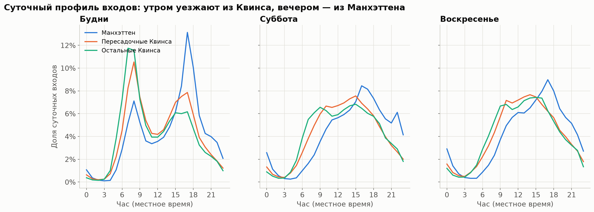{#fig:mta-profiles width=100%}

**2. Недельная сезонность.** Корреляция потока с лагом 168 ч (неделя) — медиана 0,945, с лагом 24 ч — 0,854.
Значит, «тот же час неделю назад» предсказывает лучше, чем «вчера». Исключение — Mets-Willets Point (0,22): там поток
задают матчи (@fig:mta-autocorr).

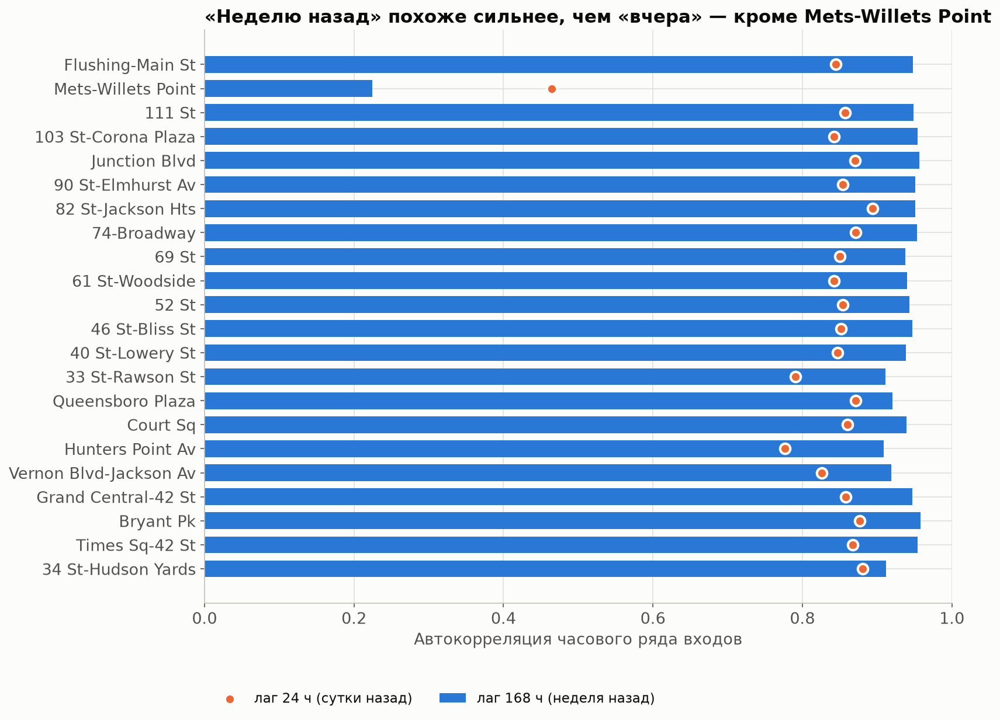{#fig:mta-autocorr width=62%}

**3. Тренд и смена уровня станций.**

- Будний день 2024 года на 5,2 % выше 2023-го, плато не видно.
- 15.05.2023 поток на 82 St упал на 47 %, на 111 St — на 38 %, а соседние станции выросли: пассажиры перешли
  к соседям.

Урок: норме нужна поправка на текущий уровень.

**4. Праздники.**

- Федеральные выходные: −35…−55 % к тому же дню недели.
- По часам праздник похож на воскресенье: корреляция профиля Дня благодарения с воскресным — 0,95, с будничным —
  0,64 (@fig:mta-thanks).

Урок, перенесённый на СПб: норма для праздника — профиль воскресенья.

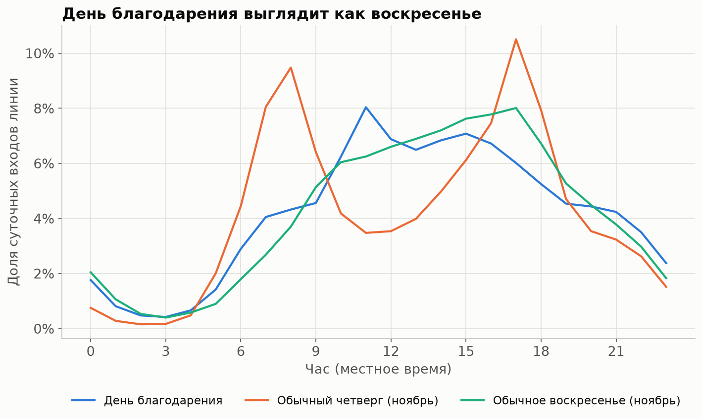{#fig:mta-thanks width=66%}

**5. Погода.**

- Дождь ≥ 0,5 мм/ч снижает поток на 2,3 %, почти весь эффект — в выходные (−8,1 %).
- Исторический прогноз отмечает меньше дождливых часов, чем было по факту, зато сохраняет 88 % эффекта.

**6. События.** После матча «Метс» на Mets-Willets Point поток в 25 раз больше обычного. Пик — в час окончания матча
по расписанию у 64 % игр (@fig:mta-mets). Это сильный, но очень локальный фактор.

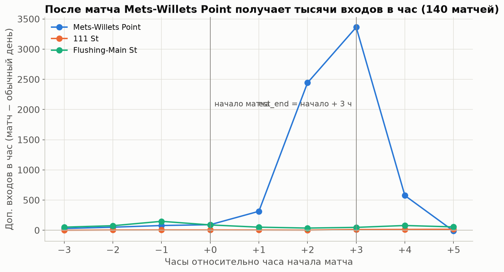{#fig:mta-mets width=66%}

**7. Шум.** Отклонение слота «станция × час» от 8-недельной медианы, взвешенное по потоку:

- медиана — 5 %;
- p80 — 12 %;
- p95 — 26 %.

Отсюда ориентиры «норма — до ±12 %, аномалия — от ±26 %» (@fig:mta-noise). На СПб они почти повторились.

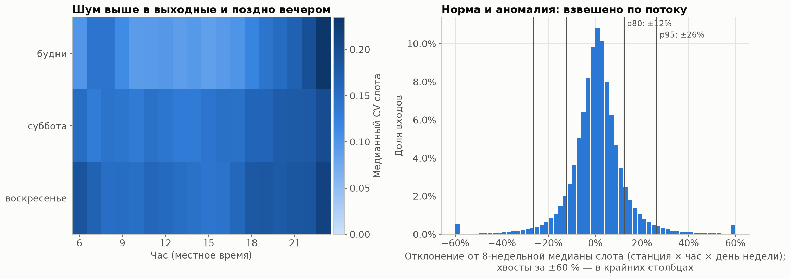{#fig:mta-noise width=100%}

## СПб, 1 линия: подробно {#sec:eda-spb}

### Профили {#sec:eda-profiles}

**Что увидели.** Отношение утреннего пика к вечернему в рабочий день сильно зависит от станции (@fig:spb-profiles,
@fig:spb-peak):

- спальные конечные — ×3,09: утром едут из дома, по вестибюлям от 1,74 до 7,6, больше всего у Девяткино I;
- центр и вокзалы — ×0,42;
- прочие — ×0,46.

Внутри групп есть исключения:

- Выборгская (×0,18) и Нарвская (×0,23) ведут себя как центр — это деловые районы;
- Пушкинская (×0,90) смешанная.

В выходные и праздники пик один. Профиль будних праздников совпадает с воскресным: корреляция 0,994.

**Что из этого следует.**

- Группы станций — спальные конечные, центр и вокзалы, прочие — используются для срезов метрик и порогов аномалии.
- Модель работает по вестибюлям: даже внутри группы профили различаются в разы.

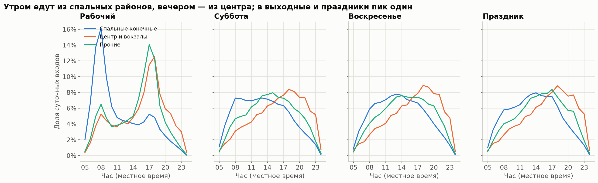{#fig:spb-profiles width=100%}

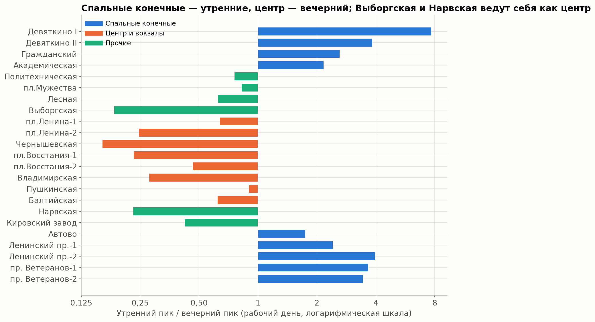{#fig:spb-peak width=72%}

### Дни недели

**Что увидели.** В отличие от MTA, понедельник и пятница почти не отличаются от вторника–четверга (@fig:spb-weekdays):

- понедельник — −3,1 % (95 % ДИ −5,8…−0,8 %);
- пятница — +1,4 % (ДИ −0,9…+3,6 %).

И всё же норма по дню недели точнее нормы по типу дня: p80 отклонения в будни 10,3 % против 10,9 %, p95 — 22,5 %
против 25,7 %.

**Решение.** Норма строится по дню недели.

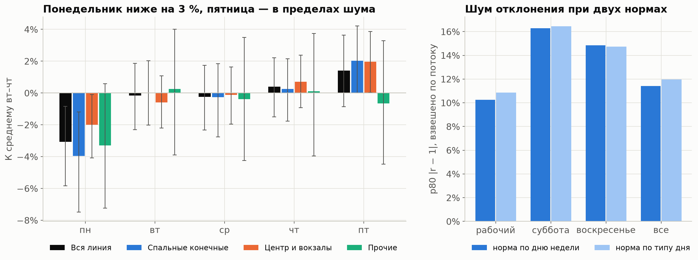{#fig:spb-weekdays width=100%}

### Тренд по месяцам и ступенька сентября {#sec:eda-trend}

**Что увидели.** Обычный рабочий день весной (март–май) — это 723 тыс. входов. Остальные месяцы относительно весны:

| Месяц | январь | июнь | июль | август | сентябрь |
|:-----------|-----:|-----:|-----:|-----:|-----:|
| К весне | −6,7 % | −1,1 % | −9,7 % | −13,7 % | −1,1 % |

: Уровень обычного рабочего дня по месяцам относительно весны {#tbl:months}

Летом сильнее всего проседают прочие станции (август −24 %) и спальные (−15 %), центр — всего −6 %.

**С 01.09 — ступенька +13,5 %** (10 рабочих дней после против 10 до):

- прочие станции — +28,3 %, учебный год: Политехническая +62 %;
- спальные — +15,1 %;
- центр — +4,6 % (@fig:spb-monthly).

**Что из этого следует.**

- Норма по 4 прошлым неделям отстаёт от тренда, поэтому нужна поправка на уровень последней недели.
- Финальный тест на сентябре — проверка на сдвиг: в его первые недели норма строится по августу.

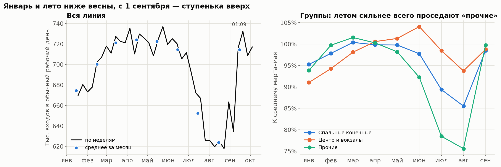{#fig:spb-monthly width=100%}

### Праздники и сокращённые дни

**Что увидели.**

- Будние праздники и перенесённые выходные — медиана −39,9 % (от −47,1 до −35,9 %, 10 дней). 1 января — −68,7 %.
- Праздник, выпавший на выходной, почти не виден: 8 марта (воскресенье) +6,1 %, 9 мая (суббота) −8,8 %.
- Сокращённые предпраздничные дни (30.04, 8.05, 11.06) за сутки отличаются в пределах ±5 %, но профиль сдвигается
  (@fig:spb-holidays, @fig:spb-shortened):
  - 14–16 ч — +26,6 % к обычному дню;
  - 18 ч — −21,4 %;
  - 22–23 ч — +12,9 %.

**Решение.**

- Для праздника и нерабочего буднего дня норма — профиль 4 последних обычных воскресений.
- Сокращённые дни — кандидаты в признаки; их проверила абляция.

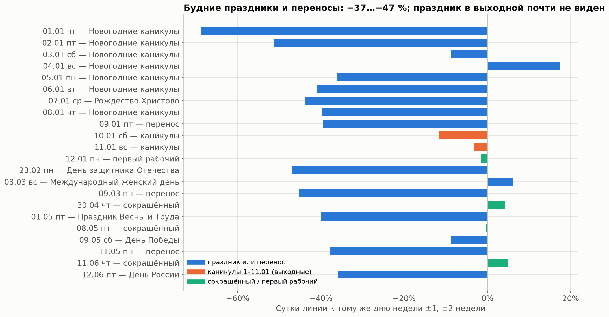{#fig:spb-holidays width=72%}

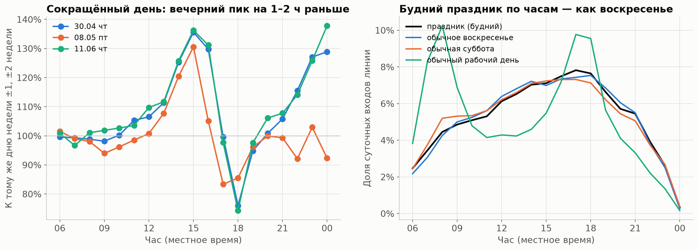{#fig:spb-shortened width=100%}

### Погода

**Что увидели** (@fig:spb-weather).

- Дождь ≥ 0,5 мм/ч снижает поток на 4,5 % (ДИ −6,1…−2,9 %), и в будни (−4,3 %), и в выходные (−6,0 %). В MTA
  будни на дождь не реагировали.
- Снег — −0,5 %, эффекта нет. Мороз ниже −15 °C — −1,0 % (ДИ −3,6…+1,4 %, всего 10 дней).
- Исторический прогноз даёт тот же эффект дождя (−4,8 %), хотя угадывает дождливые часы плохо: precision 0,49,
  recall 0,45, с допуском ±1 ч — 0,62.

**Что из этого следует.** Эффект устойчивый, но маленький по сравнению с разбросом часа (±11,4 %). Погода пошла
в абляцию одной проверкой.

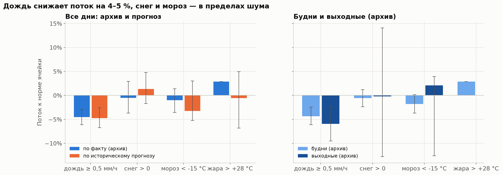{#fig:spb-weather width=100%}

### События и особые ночи

**Что увидели** (@fig:spb-events, @fig:spb-nights).

- **9 мая** — линия 0,91 к обычной субботе. Пл. Восстания-1 был закрыт, поэтому Чернышевская ×1,34: поток
  перераспределился.
- **День города** (27.05) — 0,99, сигнала нет.
- **«Алые паруса»:**
  - сутки 27.06 — ×1,12;
  - вечер 18–23 ч — ×1,36;
  - полночь — ×3,9 (по вестибюлям от 2,2 до 22,5 раза).
- **1 сентября** — ×1,12 к августовской норме, но к рабочим дням 2–8 сентября — 1,00. Это уровень сентября,
  а не праздник.
- **Перед особыми ночами** полночь выше нормы: перед 29→30.05 — ×1,53, перед «Алыми парусами» — ×3,9.

**Решение.**

- Вечера 29.05 и 27.06 и день инцидента 31.08 названы *особыми днями*. Их нет ни в обучении, ни в общих метриках,
  по ним ведётся отдельная таблица.
- Признак «впереди особая ночь, 23–00 ч» пошёл в абляцию.

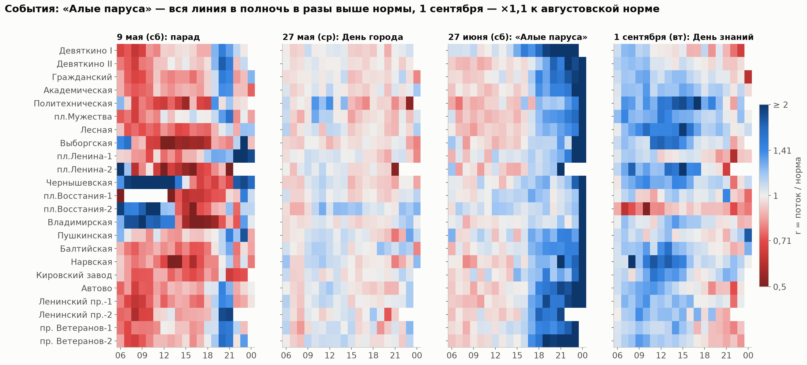{#fig:spb-events width=92%}

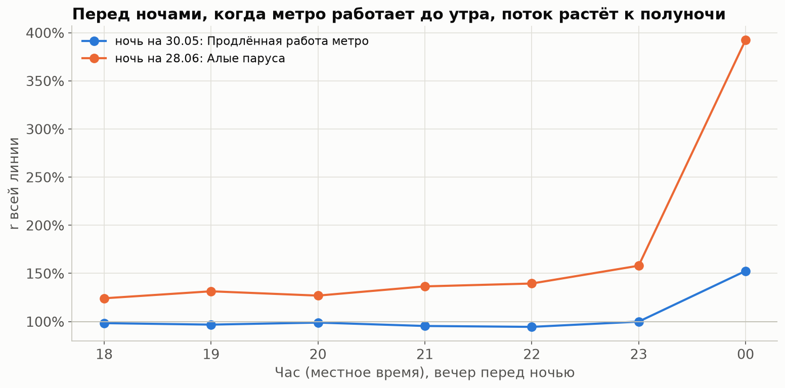{#fig:spb-nights width=70%}

### Инцидент 31.08

**Что увидели.** В 08 ч поток упал не только там, где закрывали вход (@tbl:incident-shares, @fig:spb-incident).
На Нарвской, наоборот, ×2,69: люди уходили на другие станции. В 10 ч — откат, отложенный спрос: Девяткино I ×1,41.

| Вестибюль | Доля от нормы понедельников |
|:--------------------|--------:|
| Девяткино II | 0,21 |
| Девяткино I | 0,40 |
| пл. Восстания-2 | 0,51 (в 07 ч) |
| пл. Ленина-1 | 0,62 |
| Чернышевская | 0,64 |

: Инцидент 31.08: поток в 08 ч относительно нормы {#tbl:incident-shares}

**Поиск похожих провалов.**

- Метод: окно из 3 соседних станций, где Σy/Σb < 0,75, а в следующие 1–3 ч откат > 1,05.
- Первым метод находит 31.08: 11,5 тыс. «потерянных» входов.
- Остальные кандидаты намного мельче — от 0,4 до 1,5 тыс. входов. Утренние провалы в 06 ч похожи скорее на позднее
  открытие вестибюля, чем на инцидент.
- Без подтверждения организаторов в справочник инцидентов они не вносились.

**Что из этого следует.** Других инцидентов такого масштаба в данных нет. Поэтому модель не может *научиться* провалу —
она может только правильно *реагировать* на уже начавшийся. Это и проверяет демо-кейс.

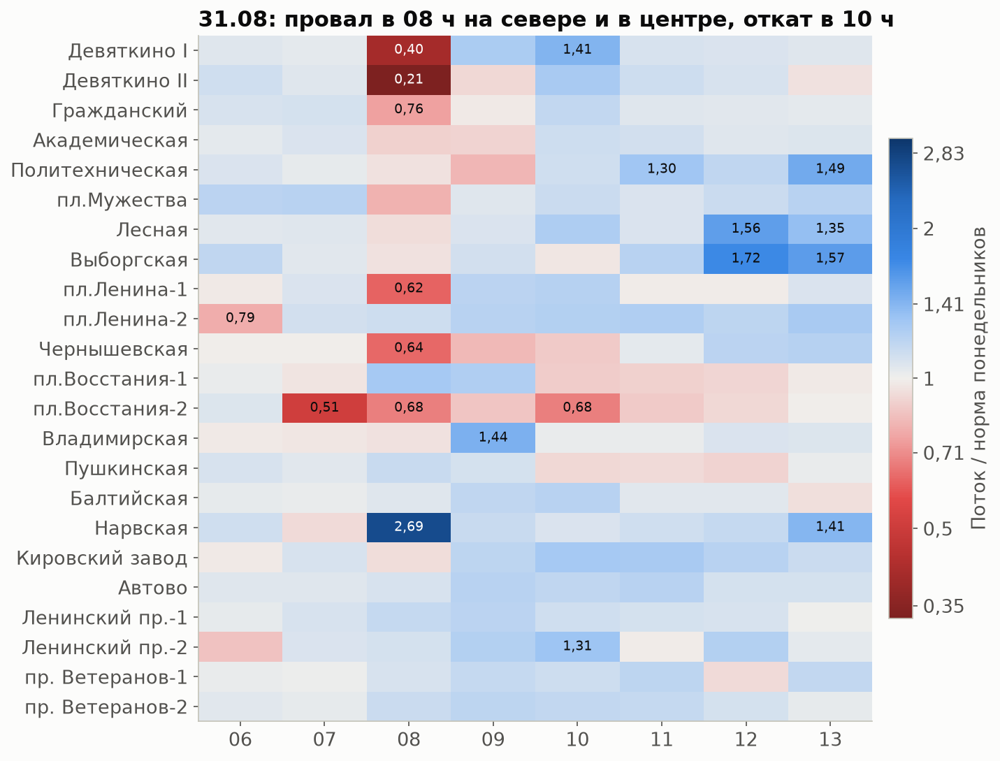{#fig:spb-incident width=66%}

### Динамика отклонения — главный сигнал {#sec:eda-dynamics}

**Что увидели** (@fig:spb-persistence, @tbl:simple-forecasts).

- **Отклонение от нормы держится 2–3 часа.** Корреляция log r с лагом 1 / 2 / 3 ч — медиана 0,72 / 0,59 / 0,44.
- **После часа с r > 1,15** выше 1,15 остаётся 50 % следующих часов (без условия — 11 %), через 2 ч — 44 %.
- **Утро подсказывает вечер.** Σy/Σb с открытия до 09 ч связано с r в 17–18 ч того же дня, корреляция Спирмена 0,48.

| Прогноз | WAPE, t+1 | WAPE, t+2 |
|:--------------------------------|------:|------:|
| норма b | 8,53 % | 8,53 % |
| b × r(t) | 6,74 % | 7,85 % |
| b × сглаженное r, полупериод 2 ч | 6,81 % | 8,10 % |
| b × сглаженное r, полупериод 6 ч | 7,43 % | 8,02 % |

: Простые прогнозы на EDA (февраль–сентябрь, норма EDA) {#tbl:simple-forecasts}

Выигрыш b × r(t) есть во все месяцы, кроме апреля (−0,10 п. п., ДИ включает 0).

**Что из этого следует.** Отклонение последних часов — главный кандидат в признаки. На нём строятся лучший простой
прогноз и модель.

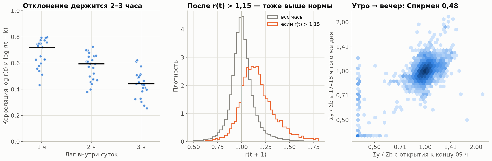{#fig:spb-persistence width=100%}

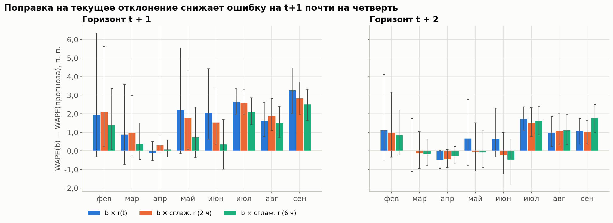{#fig:spb-simple width=100%}

### Синхронность станций

**Что увидели** (@fig:spb-sync). Корреляция log r между вестибюлями:

- одной станции — 0,48;
- соседних станций — 0,45;
- через 5 и больше станций — 0,35.

С r всей линии — 0,62: от 0,30 у пл. Восстания-2 до 0,75 у Чернышевской.

**Что из этого следует.** Линия задаёт общий фон дня, соседи добавляют местную часть. Это основание для кросс-признаков:
r линии, r соседей, r второго вестибюля.

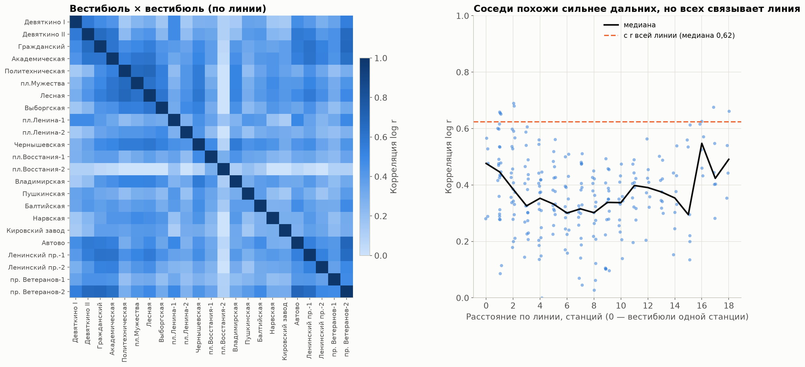{#fig:spb-sync width=90%}

### Шум и пороги аномалии {#sec:eda-noise}

**Что увидели** (@tbl:noise, @fig:spb-noise). |r − 1| на обычных днях, взвешено по потоку.

| Уровень | p50 | p80 | p95 |
|:---------------------|-----:|-----:|-----:|
| вся линия | 5,0 % | 11,4 % | 24,2 % |
| утро 07–09 | — | 9,0 % | — |
| поздно 20–00 | — | 16,6 % | — |
| центр и вокзалы | — | — | 26,4 % |
| спальные | — | — | 20,2 % |

: Шум слота: квантили |r − 1| {#tbl:noise}

В MTA было p80 12 % и p95 26 % — уровни почти те же.

**Решение.**

- Аномальный час — |r − 1| выше p95 своей группы станций и периода суток.
- Пороги по сочетанию «группа × период» лежат в `reports/backtest/anomaly_thresholds.csv`; они посчитаны без сентября.

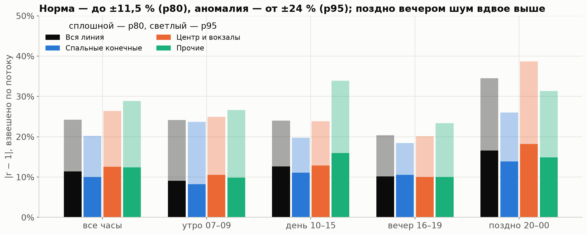{#fig:spb-noise width=90%}

### Ёмкость линии (грубая оценка)

**Что увидели** (@fig:spb-capacity).

- В сентябре в 08 ч в линию входит 74,7 тыс. пассажиров.
- Провозная способность — 32 пары × 1 458 чел. = 46,7 тыс. в одном направлении. Получается ×1,60 к одному направлению
  и ×0,80 к двум; в 17 ч — тоже ×1,60.
- Летом: 08 ч — ×1,35, 18 ч — ×1,53.

**Почему грубо.** В данных только входы, без пересадок и направлений. Нагрузка самого загруженного перегона не равна
сумме входов. Точную загрузку перегонов считает симулятор (роль 3), используя наш прогноз.

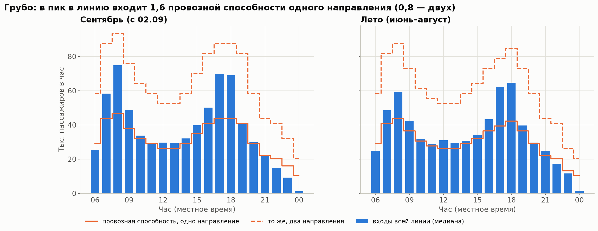{#fig:spb-capacity width=100%}

# Отбор признаков {#sec:selection}

## Зачем отбор и что отбирали

**Что сделали.** В данных всего три колонки: вестибюль, час, входы. Значит, качество модели целиком зависит от признаков,
которые мы из них выведем. По разделу 5 ТЗ составлен список из **56 кандидатов**, каждый проверен на двух горизонтах
(112 проверок). В списке:

- динамика потока: приросты, ускорение, отклонение и его изменение, сглаженное отклонение, накопленное с открытия;
- кросс-признаки линии;
- погода по историческому прогнозу;
- календарь;
- собственные идеи: отклонение вчера в тот же час, Σy/Σb вчерашних суток, сокращённый день по часам, вечер перед
  особой ночью;
- контрольный случайный шум.

**Зачем отбор до модели.**

- Абляция на модели дорогая: одна конфигурация считается около 2,5 минуты на 4 фолдах.
- Абляция проверяет группы, а не 56 признаков по одному.
- Отбор отсекает пустые кандидаты и подсказывает, какие группы проверять.

## Процедура {#sec:selection-proc}

Для каждого кандидата x и горизонта h:

1. **Цель** — логарифм отклонения в часе τ = t + h: log((y + 1)/(b + 1)).
2. **Сравнение внутри слота «вестибюль × час».** И кандидат, и цель переводятся в ранги внутри своего слота. Это
   *стратифицированный Спирмен*: сравниваются дни одного вестибюля и часа, так что суточный профиль и размер вестибюля
   не создают ложной связи. Для бинарных кандидатов эффект — разница медиан цели при x = 1 и x = 0.
3. **Доверительный интервал** — *блочный бутстреп по дням*. Перевыбираются целые дни, а не отдельные часы: часы одного
   дня зависимы, и обычный бутстреп занизил бы ширину интервала.
4. **p-value** — *перестановочный тест*. Целые дни переставляются внутри страты «месяц × рабочий / нерабочий». Так
   сохраняются и зависимость часов внутри дня, и сезонность, а разрушается только связь кандидата с целью.
5. **Поправка Бенджамини–Хохберга** — на все 112 тестов сразу. При стольких проверках часть «значимых» результатов
   была бы случайной; BH ограничивает долю ложных открытий.
6. **Стабильность** — знак эффекта совпадает минимум в 75 % месяцев (если месяцев с данными не меньше 4).
7. **Дубли** — если два кандидата связаны с корреляцией Спирмена выше 0,95, остаётся более сильный.
8. **Польза для прогноза (ΔWAPE).** Прогноз b · e^поправка сравнивается с b. Поправка — медиана цели в корзине
   кандидата по прошлым месяцам (расширяющееся окно) минус общая медиана тех же месяцев. Тест — апрель–август;
   сентябрь — финальный тест, и отбор признаков его не видит. ДИ — парный бутстреп по дням, p — тест Диболда–Мариано.

**Альтернативы и почему не они.**

- *Обычная корреляция по всем строкам* поймала бы суточный профиль: в 08 ч и поток, и почти любой признак большие.
- *t-тест без учёта зависимости часов* дал бы заниженные p-value.
- *Отбор по важности признаков в самой модели* смешивает пользу с дублированием: два похожих признака делят важность,
  и оба выглядят слабыми.

## История правила: от «эффект против шума» к «пользе для прогноза» {#sec:selection-history}

**Первое правило было ошибкой.** Вердикт сравнивал размер эффекта кандидата с шумом слота — p80 |r − 1| = 11,4 %.
Кандидат с эффектом меньше шума отбрасывался. Под это правило попали почти все признаки динамики, кроме самых сильных.

**В чём ошибка.**

- Шум слота — это разброс *одного наблюдения* вокруг нормы.
- Эффект признака — это *систематический* сдвиг среднего, когда признак принимает определённое значение.

Это разные величины. Признак, который сдвигает прогноз всего на 3 %, всё равно уменьшает ошибку, если сдвигает в правильную
сторону в большинстве случаев. Сравнивать его с разбросом отдельного часа нельзя.

**Новое правило.** Значимый кандидат (после BH) с эффектом меньше шума, но с ΔWAPE > 0 и ДИ выше нуля получает вердикт
«проверить в абляции». ΔWAPE пересчитан для всех значимых кандидатов без дублей на апреле–августе — без сентября.
Окончательное решение принимает абляция на модели (@sec:model-ablation).

**Что изменилось.** Сменились 32 вердикта: с «отбросить» на «проверить в абляции».

| Горизонт | Брать | Проверить в абляции | Отбросить |
|:---------|------:|------:|------:|
| t+1 | 9 | 19 | 28 |
| t+2 | 8 | 19 | 29 |

: Итог отбора по пересмотренному правилу {#tbl:screening}

**Контрольный шум не прошёл:** p_BH = 0,99. Это проверка самой процедуры: на чистом шуме она не находит «значимого»
признака.

{#fig:screening-old width=78%}

{#fig:screening-new width=88%}

**Польза сильнейших кандидатов на t+1** (апрель–август, WAPE нормы b — 8,12 %):

- r(t) — +1,50 п. п.;
- сглаженное r (2 ч) — +1,34 п. п.;
- r линии — +1,23 п. п.;
- Σy/Σb с открытия — +1,20 п. п.;
- r соседей — +1,15 п. п.

На t+2 выигрыш примерно в 1,4 раза меньше.

Около 40 % связи r(t) с целью — общий уровень месяца: центр нулевого распределения перестановок 0,23 при эффекте 0,56.
Норма по 4 прошлым неделям отстаёт от тренда, и r это отставание ловит. Отсюда поправка на уровень в норме
(@sec:baselines).

## Группы для абляции

Кандидаты «брать» сильно связаны между собой: все они меряют одно и то же отклонение. Поэтому их проверяли не по одному,
а **группами**, в порядке от самой сильной (@tbl:groups).

| Группа | Признаки | Почему в таком порядке |
|:--------------------|:---------------------------------------------------|:---------------------------------------|
| 1. Ядро динамики | r(t), сглаженное r (2 и 6 ч), Σy/Σb с открытия, y(t)/y(t−168) | ΔWAPE каждого +0,6…+1,5 п. п. на t+1 |
| 2. Кросс | r линии и её сглаженное значение, r соседних станций (±2), r второго вестибюля, доля вестибюля в линии | корреляция с линией 0,62, с соседями 0,45 |
| 3. Скорость и ускорение | приросты против обычного за 1–3 ч, изменение r за 2 и 3 ч | по отдельности +0,06…+0,18 п. п.; вопрос — есть ли польза поверх ядра |
| 4. Вчера | r того же часа вчера, Σy/Σb вчерашних суток | +0,66 и +0,55 п. п. |
| 5. Погода | прогноз дождя на час τ, осадки за 3 ч | отбор не поддерживает (ДИ касается нуля), но эффект дождя стабилен |
| 6. Особые дни | сокращённый день 14–16 и 17–19 ч, вечер перед особой ночью | признаки редкие (2–7 дней), тест слабый |

: Шесть групп абляции {#tbl:groups}

**Не брать:**

- ускорение y и r, волатильность r, y(t)/y(t−24), абсолютные приросты за 2–3 ч — ΔWAPE неотличим от нуля;
- дни до и после праздника, учебный период, плановая парность, день события — не значимы.

# Бейзлайны и каркас бэктеста {#sec:baselines}

## Нормы {#sec:norms}

Норма — это «сколько обычно входит в этот час». Она нужна трижды:

- как самостоятельный прогноз;
- как опора цели модели;
- как поле `baseline` в контракте.

Все нормы строятся только по прошлому. В историю идут лишь обычные сутки без флагов: не 1–11 января, не праздники и
не дни событий.

- **b4 (основная)** — медиана того же вестибюля, часа и дня недели по 4 последним обычным таким же суткам, поиск
  до 8 недель назад.
  - Для праздника и нерабочего буднего дня — по 4 последним обычным воскресеньям.
  - Пример: 23.02 в 08 ч у Девяткино II норма — 2 674 при факте 2 740. Понедельничная норма была бы 10 084.
- **b8** — то же по 8 последним суткам. Сильнее отстаёт от тренда.
- **Уровень** — медиана суточного Σy/Σb вестибюля по 7 последним обычным суткам строго до дня прогноза.
  В июле фактор около 0,94, 10 сентября — 1,13: он закрывает отставание нормы от тренда.

$$\begin{aligned}
b_4(\tau) &= \operatorname{median}\{\,y(\tau - 168k)\ :\ \text{4 последних обычных таких же дня}\,\},\\
f_{\text{ref}}(\tau) &= b_4(\tau)\cdot \text{уровень}_7(\tau)
\end{aligned}$$ {#eq:norm}

**Почему медиана, а не среднее.** Один необычный день, например с закрытием или дождём, не сдвигает медиану.

**Почему 4 недели, а не 8.** Длинная норма сильнее отстаёт от тренда: 8,97 % против 7,59 % WAPE (@tbl:ladder).

**Почему не сезонная декомпозиция с годовым циклом.** Данных 9 месяцев, годовой сезонности в них нет.

## Фолды, зазор и закрытый сентябрь {#sec:folds}

**Что сделали.** Бэктест на четырёх тестовых месяцах — май, июнь, июль, август — с *расширяющимся окном* (@fig:folds,
@tbl:folds):

- обучение начинается 09.02, когда у нормы уже есть 4 недели истории;
- обучение заканчивается за 7 суток до теста;
- тест — весь следующий месяц.

| Фолд | Обучение (сутки метро) | Тест |
|:--------|:------------------|:------------------|
| май | 09.02 – 23.04 | 01.05 – 31.05 |
| июнь | 09.02 – 24.05 | 01.06 – 30.06 |
| июль | 09.02 – 23.06 | 01.07 – 31.07 |
| август | 09.02 – 24.07 | 01.08 – 31.08 |
| финальный | 09.02 – 24.08 | 01.09 – 29.09, один раз |

: Фолды бэктеста {#tbl:folds}

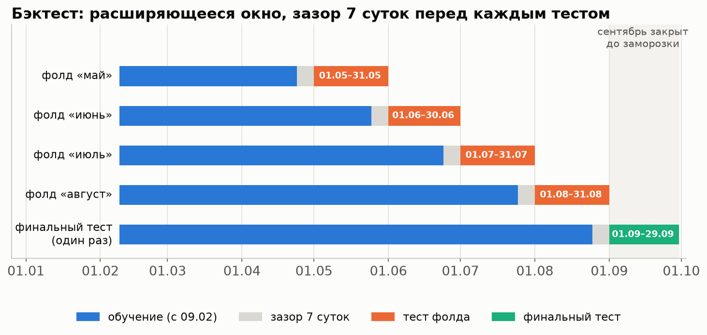{#fig:folds width=100%}

**Зачем расширяющееся окно.**

- Данных мало, 9 месяцев. Каждому следующему фолду достаётся больше истории — так же, как будет в эксплуатации,
  где модель переобучают на всей накопленной истории.
- Скользящее окно фиксированной длины выбросило бы ранние месяцы, а их и так немного.

**Зачем зазор в 7 суток.**

- Признаки смотрят в прошлое до 168 ч (тот же час неделю назад).
- Без зазора последние дни обучения и первые дни теста были бы почти одними и теми же ситуациями, и оценка была бы
  оптимистичной.

**Почему не случайное разбиение (k-fold).** Тогда модель обучалась бы на будущем и проверялась на прошлом: соседние часы
одного дня попадали бы и в обучение, и в тест. Для временных рядов это утечка.

**Почему сентябрь закрыт.**

- Сентябрь — финальный тест, единственная по-настоящему невиданная проверка, причём на сдвиге: новый учебный год
  и ступенька +13,5 %.
- Без флага `--final` поток сентябрьских суток превращается в NaN ещё *до* расчёта нормы и входов. Так сентябрь
  не видит ни один код: ни отбор признаков, ни бейзлайны, ни абляция.
- Это проверяет тест.

## Метрики {#sec:metrics}

- **WAPE** — главная метрика (@eq:wape): суммарная абсолютная ошибка медианного прогноза, делённая на суммарный поток.
  Ошибка на Девяткино II в час пик весит больше, чем на малом вестибюле ночью, — так и нужно для планирования
  составов.
- **MAE** — средняя абсолютная ошибка в пассажирах.
- **Pinball loss** — для квантилей q10, q50, q90 (@eq:pinball); нормированный — делённый на средний поток.
- **Покрытие** интервала q10–q90 — доля часов, где факт внутри интервала. Цель — 80 %.

Всё считается отдельно для t+1 и t+2, по всем тестовым строкам 4 фолдов вместе и по каждому фолду.

$$\mathrm{WAPE} = \frac{\sum_i |y_i - \hat q_{50,i}|}{\sum_i y_i},\qquad
\text{покрытие} = \frac{1}{n}\sum_i \mathbf{1}\{\hat q_{10,i} \le y_i \le \hat q_{90,i}\}$$ {#eq:wape}

**Срезы:**

- все часы;
- пики 07–09 и 17–19;
- три группы станций;
- аномальные часы — |r(τ) − 1| выше p95 своей группы и периода суток;
- праздники — контрольный срез: 1, 9, 11 мая и 12 июня, 3 620 строк на модель.

Особые дни (29.05, 27.06, 31.08) считаются отдельной таблицей.

## Лестница бейзлайнов {#sec:ladder}

**Что сделали.** Прежде чем строить модель, нужно знать, что умеют простые правила. Бейзлайнов семь, от самого простого
к более умным. Квантили бейзлайнов:

- q50 — сам прогноз f;
- q10 и q90 — f, умноженный на 10-й и 90-й эмпирические квантили отношения y/f на обучении, по ячейке
  «группа × период суток × h».

| Модель | WAPE, все часы | WAPE, пики | Покрытие q10–q90 | WAPE t+1 / t+2 |
|:-----------------------------------------|------:|------:|------:|------------:|
| Сезонный наивный (неделю назад) | 10,01 % | 9,29 % | 77,5 % | 10,01 % / 10,01 % |
| Норма b (4 недели) | 7,59 % | 6,35 % | 70,1 % | 7,59 % / 7,59 % |
| b по 8 неделям | 8,97 % | 7,91 % | 64,0 % | 8,97 % / 8,97 % |
| b × уровень последних 7 дней | 6,83 % | 5,59 % | 75,4 % | 6,83 % / 6,83 % |
| b × сглаженное r (2 ч) | 6,86 % | 6,24 % | 76,3 % | 6,31 % / 7,42 % |
| b × r(t) | 6,70 % | 5,79 % | 77,6 % | 6,29 % / 7,11 % |
| **b × уровень × r(t)** — лучший | **6,66 %** | 5,74 % | 78,2 % | **6,28 % / 7,05 %** |

: Лестница бейзлайнов, 4 фолда вместе: 111 488 тестовых строк на модель, метрики — по 108 948 строкам без особых дней {#tbl:ladder}

**Что видно.**

- **Отклонение r(t) даёт главный выигрыш:** 6,28 % на t+1 против 7,59 % у нормы. На t+2 выигрыш вдвое меньше —
  r держится 2–3 часа. В аномальные часы ошибка падает с 26,37 % до 16,43 %.
- **Поправка на уровень** сама по себе даёт 6,83 %, а в пики — 5,59 %, лучший результат лестницы. Вместе с r(t)
  поправка добавляет мало (6,70 → 6,66 %): r(t) это отставание уже ловит.
- **Сезонный наивный в мае — 14,09 %.** Майские праздники неделю назад ломают «тот же час неделю назад». Норма
  с воскресным профилем для праздников держит май на 6,88 %.
- **Слабость r-бейзлайнов — откат после провала.** 31.08 в 08 ч у Девяткино r ≈ 0,3, и «b × уровень × r(t)»
  переносит провал вперёд: прогноз на 09 ч — 2 849 при норме 8 295, а поток уже вернулся к норме. Ловить откат
  должна модель.

Лучшим бейзлайном выбран «b × уровень × r(t)». Именно с ним сравнивается модель — по ΔWAPE, ДИ и тесту
Диболда–Мариано.

## Почему q50 бейзлайнов не центрировали {#sec:centering}

**Что проверили.** Договорённый вариант — q50 = f × медиана y/f в той же ячейке. Идея: медиана поправит систематический
сдвиг прогноза.

**Что показали данные.** Ни одному бейзлайну центрирование не помогло (@tbl:centering).

| Бейзлайн | q50 = f | q50 = f × медиана y/f |
|:--------------------------|------:|------:|
| Сезонный наивный | 10,01 % | 10,10 % |
| b (4 недели) | 7,59 % | 7,90 % |
| b по 8 неделям | 8,97 % | 9,67 % |
| b × уровень | 6,83 % | 6,84 % |
| b × r(t) | 6,70 % | 6,74 % |
| b × сглаженное r (2 ч) | 6,86 % | 6,86 % |
| b × уровень × r(t) | 6,66 % | 6,68 % |

: Центрирование q50 бейзлайнов {#tbl:centering}

**Почему.**

- Медиана y/f обучающих месяцев не переносится на тестовый. Норма отстаёт от тренда, и это отставание меняет знак:
  весной поток рос и медиана y/b была больше 1, летом поток падает, а весенняя поправка тянет прогноз вверх.
  Июль у b: 8,52 % → 9,22 %.
- У r-бейзлайнов медиана и так около 1: r(t) уже ловит уровень дня.

Поэтому оставлен q50 = f, а центрирование доступно как опция.

# Модель {#sec:model}

## Цель — отношение к норме {#sec:model-target}

**Что сделали.** Модель предсказывает не сам поток y, а логарифм его отношения к норме:

$$z = \log\frac{y + 1}{f_{\text{ref}} + 1},\qquad f_{\text{ref}} = b_4 \cdot \text{уровень}_7,\qquad
\hat y_q = (f_{\text{ref}} + 1)\,e^{\hat z_q} - 1 \ \ (\text{не меньше } 0)$$ {#eq:target}

Единица в числителе и знаменателе защищает от деления на ноль в часы с малым потоком. Если норма меньше одного входа,
все квантили приравниваются к норме: модель не берётся прогнозировать почти пустой час.

**Зачем.** Отношение снимает с модели две трудные и уже известные вещи:

- суточный профиль — утром и вечером поток в разы больше;
- разницу масштабов вестибюлей — у Девяткино II до 11 тыс. входов в час, у малых вестибюлей — сотни.

Модель учит только «насколько сегодня не как обычно». А это как раз то, что держится 2–3 часа и подхватывается
признаками динамики (@sec:eda-dynamics).

**Альтернатива — цель log1p(y).** Её сравнили на полном наборе признаков:

- отношение к норме лучше: 5,49 % против 5,76 % WAPE, ΔWAPE +0,27 п. п. [+0,20; +0,32], p < 0,001;
- log1p(y) выигрывает только в аномальных часах (17,35 % против 17,67 %) и в праздники (11,64 % против 12,73 %).

## Квантильная регрессия и LightGBM {#sec:model-lgbm}

**Что сделали.** Обучаются три модели градиентного бустинга LightGBM с целью «квантиль» (`objective="quantile"`), по одной
на α = 0,1, 0,5 и 0,9. Каждая минимизирует свою функцию потерь *pinball*:

$$L_\alpha(y, q) = \max\bigl(\alpha\,(y - q),\ (\alpha - 1)\,(y - q)\bigr)$$ {#eq:pinball}

При α = 0,5 это половина абсолютной ошибки, то есть медиана. При α = 0,9 недооценка штрафуется в 9 раз сильнее
переоценки, и модель учит верхнюю границу. После предсказания квантили сортируются, чтобы q10 ≤ q50 ≤ q90.

**Зачем квантили, а не «среднее ± стандартное отклонение».** Распределение отклонений несимметрично: провалы бывают
глубже всплесков, и наоборот, в зависимости от часа и станции. Квантили не требуют предположения о форме
распределения.

**Почему LightGBM.**

- Данные табличные, а нужные зависимости — взаимодействия: час × станция × текущее отклонение. Деревья ловят их
  без ручного конструирования.
- LightGBM сам работает с пропусками: признак вида r(t) не определён ночью и в первые часы суток.
- Вестибюль, группа станций и тип дня задаются как категории.
- Конфигурация обучается за секунды, что важно для абляции.

**Альтернативы и почему не они.**

- *Линейная регрессия* не поймает взаимодействия без ручной работы.
- *Нейросети и графовые модели* требуют больше данных, чем 9 месяцев, и больше времени, чем есть на хакатоне.
  ТЗ сознательно их исключает.
- *CatBoost MultiQuantile* (одна модель на все квантили) был в ТЗ как необязательный. Он остался в улучшениях.

**Параметры** — умеренные значения по умолчанию, без подбора (@tbl:params). В разделе 6 ТЗ гиперпараметров нет;
оттуда взяты квантили 0,1 / 0,5 / 0,9, сортировка и правило «при норме ≈ 0 прогноз равен норме».

| Параметр | Значение | Зачем |
|:--------------------------|:------------|:------------------------------------------------|
| learning_rate | 0,05 | небольшой шаг: устойчивее при ранней остановке |
| num_leaves, min_data_in_leaf | 31, 200 | умеренная сложность дерева; лист не меньше 200 строк — против подгонки под шум |
| feature_fraction, bagging_fraction, bagging_freq | 0,9; 0,8; 1 | немного случайности — меньше переобучения |
| lambda_l2 | 1 | регуляризация листьев |
| число деревьев | до 3 000, ранняя остановка 100 | точное число — по отложенной выборке |
| seed, deterministic | 0, да | воспроизводимость |

: Параметры LightGBM {#tbl:params}

**Веса строк.** У каждой строки вес f_ref. WAPE взвешен потоком: ошибка в час пик на большом вестибюле важнее, чем ночью
на малом. Без весов цель-отношение учила бы относительную ошибку, и малые вестибюли и крайние часы 05, 23, 00 тянули бы
модель на себя.

## Отложенная модель, ранняя остановка и калибровка {#sec:model-calib}

Внутри обучающего окна W выделяются два окна по суткам:

- C — последние 28 суток (окно калибровки);
- E — последние 14 суток (окно ранней остановки), E ⊂ C.

Тест в этих расчётах не участвует.

1. **Отложенная модель** учится на W без C. Число деревьев выбирается *ранней остановкой* по E: обучение прекращается,
   когда pinball на E 100 итераций подряд не улучшается.
2. **Конформная поправка (CQR).** Отложенная модель предсказывает окно C, которое не видела. По её ошибкам считаются
   поправки к нижнему и верхнему квантилю в пространстве z:

   $$c_{\text{lo}} = Q_{(1-\alpha)(1+1/n)}\bigl(\hat z_{10} - z\bigr),\qquad
   c_{\text{hi}} = Q_{(1-\alpha)(1+1/n)}\bigl(z - \hat z_{90}\bigr),\qquad \alpha = 0{,}1$$ {#eq:cqr}

   В прогнозе используются q10 − c_lo и q90 + c_hi. Поправки считаются отдельно по ячейкам «период суток × h»;
   если в ячейке меньше 300 строк, берётся общая поправка. Множитель (1 + 1/n) — поправка на конечную выборку.
3. **Итоговая модель** учится на всём W с числом деревьев из шага 1.

**Зачем так сложно.**

- Ранняя остановка по тесту — это подгонка под тест.
- Калибровка на тех же данных, на которых модель училась, даёт слишком узкий интервал: на обучающих строках модель
  ошибается меньше, чем на новых.
- Поэтому и число деревьев, и поправка берутся с отложенной модели, на данных, которых она не видела.

**Почему поправка асимметричная.** Нижний и верхний хвосты ошибок разные: c_lo и c_hi бывают и положительными
(расширить), и отрицательными (сузить).

**Что показали данные** (@fig:calibration).

- Сырые квантили LightGBM узковаты: покрытие на бэктесте 73,4 %.
- После поправки — 80,3 %, по фолдам 77,4–82,8 %.
- В сентябре поправка тоже помогла (67,9 % → 71,7 %), но до 80 % не дотянула: уровень сдвинулся (@sec:final).

{#fig:calibration width=92%}

**Интервал станции.**

- q50 станции — сумма q50 вестибюлей.
- Сумма квантилей вестибюлей завысила бы интервал станции: вестибюли не ошибаются в одну сторону одновременно.
- Поэтому интервал станции — q50 станции × квантили отношения «факт / q50» по ячейке «группа × период × h».
  Они посчитаны на прогнозах отложенной модели в окне C, вне выборки.

## Признаки финальной модели

В финальной модели 26 признаков в пяти группах (@tbl:features-short). Полный список с формулами — в приложении [-@sec:app-features].

Все признаки вида r считаются к той же норме f_ref, что и цель. Поток на входе — наблюдённый: закрытые часы — пропуск,
час инцидента входит. Признаки часа τ (норма, календарь, прогноз погоды) известны заранее; лаги потока у τ — не ближе
τ − 24.

| Группа | Признаки |
|:------------------|:--------------------------------------------------------------------------|
| база (12) | вестибюль, группа станций (категории), час τ, день недели τ, тип дня τ, h, b4(τ), уровень 7 дней, y(t), y(t−1), y(τ−24), y(τ−168) |
| ядро динамики (5) | r(t), сглаженное r (полупериоды 2 и 6 ч), Σy/Σf с открытия, y(t)/y(t−168) |
| кросс (5) | r линии и сглаженное за 2 ч, r соседних станций (±2), r второго вестибюля, доля вестибюля в линии к обычной |
| вчера (2) | r того же часа вчера, Σy/Σf вчерашних суток |
| погода (2) | исторический прогноз Open-Meteo: дождь ≥ 0,5 мм/ч в час τ, осадки за τ−2…τ |

: Признаки финальной модели по группам {#tbl:features-short}

**Признаков месяца и даты нет.** В тестовом месяце они принимают значения, которых модель не видела, и дерево ведёт себя
непредсказуемо.

**Флага праздника в группе «особые дни» нет.** Его роль играет «тип дня τ» в базе: рабочих суббот в 2026 году нет,
и сверх дня недели тип дня означает только «праздник или перенос».

**Тесты на утечку будущего.**

- **Обрезка данных.** Поток после конца часа t удаляется, будущие флаги инцидента снимаются, панель пересобирается
  заново. После этого признаки строк с исходным часом t должны совпасть полностью. Проверено в трёх точках:
  - 08.07 09:00 — обычный будний час;
  - 31.08 08:00 — инцидент: о часах 09–10 под флагом в момент t ещё неизвестно;
  - 15.06 04:00 — ночь, τ уже в следующих сутках метро.

  Тест проверен на чувствительность: если подложить признак из часа t + 1, он падает.
- **Нет признаков даты и месяца:** по именам, по типам колонок и по монотонной связи со временем — модуль корреляции
  Спирмена со временем меньше 0,8.
- **Признаки не подменяют колонки бэктеста.** Одноимённый признак однажды затёр колонку, по которой считался бейзлайн
  «b × r(t)». Ошибку нашли и исправили, а теперь совпадение имён запрещено и проверяется тестом.

## Последовательная абляция {#sec:model-ablation}

**Что сделали.** Группы признаков добавлялись к модели по одной, в порядке из @tbl:groups:
база → + ядро → + кросс → + скорость → + вчера → + погода → + особые дни.

**Правило.** Группа остаётся, если ΔWAPE к текущему набору:

- в среднем по 4 фолдам больше нуля;
- положителен хотя бы в 3 фолдах из 4.

Отброшенная группа дальше не идёт: «+ вчера» добавлялась к набору без скорости.

Для каждого шага посчитаны:

- WAPE по срезам;
- ΔWAPE с 95 % ДИ блочным бутстрепом по дням (1 000 повторов);
- тест Диболда–Мариано к предыдущему шагу и к лучшему бейзлайну.

**Зачем такое правило.** «Средний Δ > 0» — необходимое условие пользы. «3 фолда из 4» защищает от группы, которая
помогла в одном месяце случайно и испортила остальные.

| Шаг | WAPE | t+1 / t+2 | ΔWAPE к пред. шагу, п. п. [95 % ДИ] | p DM | Δ > 0 в фолдах | Решение |
|:-----------------------|-------:|-----------------:|--------------------------:|-------:|-------:|:----------|
| база | 6,64 % | 6,60 % / 6,68 % | — | — | — | — |
| + ядро динамики | 5,85 % | 5,69 % / 6,00 % | +0,80 [+0,63; +0,98] | < 0,001 | 4 из 4 | оставлена |
| + кросс | 5,66 % | 5,45 % / 5,88 % | +0,18 [+0,13; +0,24] | < 0,001 | 4 из 4 | оставлена |
| + скорость и ускорение | 5,67 % | 5,44 % / 5,89 % | −0,00 [−0,02; +0,01] | 0,915 | 2 из 4 | отброшена |
| + вчера | 5,54 % | 5,36 % / 5,72 % | +0,13 [+0,09; +0,17] | < 0,001 | 4 из 4 | оставлена |
| **+ погода — финальная** | **5,51 %** | **5,33 % / 5,68 %** | +0,03 [+0,01; +0,05] | 0,012 | 4 из 4 | оставлена |
| + особые дни | 5,49 % | 5,32 % / 5,66 % | +0,02 [−0,01; +0,05] | 0,342 | 1 из 4 | отброшена |

: Абляция: 4 фолда вместе, метрики по 108 948 строкам на модель (без особых дней); WAPE и покрытие — среднее по t+1 и t+2 {#tbl:ablation}

{#fig:ablation width=100%}

**Что показала абляция.**

- **База без динамики** — уровень лучшего бейзлайна: 6,64 % против 6,66 %, ΔWAPE +0,02 [−0,26; +0,27], p = 0,911.
  В пики база лучше (5,46 % против 5,74 %), а в аномальных часах намного хуже (23,24 % против 16,43 %): без r(t)
  модель не видит, что сегодня не как обычно.
- **Ядро динамики даёт главный выигрыш:** +0,80 п. п. Кросс и вчера — +0,18 и +0,13. Это подтверждает EDA: отклонение
  держится, линия задаёт фон дня.
- **Скорость и ускорение поверх ядра ничего не добавляют:** −0,00 п. п., ДИ вокруг нуля. На отборе они проходили
  по отдельности, но всё, что в них есть, уже несёт ядро.
- **Погода прошла правило на грани:** +0,03 п. п. [+0,01; +0,05], но в июле Δ всего +0,0004 п. п. Эффект малый,
  но устойчивый — как и −4,5 % от дождя на EDA.
- **Особые дни отброшены, как и ожидали.** Их признаки ненулевые только в тестах мая (8.05) и июня (11.06):
  - в мае Δ ровно 0 — в обучении до 23.04 нет ни одного сокращённого дня, и признак не мог ничему научить;
  - вечер перед особой ночью не попадает в обучение вообще: 29.05 и 27.06 — особые дни;
  - на самих 8.05 и 11.06 выигрыш +0,74 п. п. [0,00; +1,45] — 2 дня, тест слабый.

  Правило «3 фолда из 4» не видит признаки, которые встречаются не в каждом месяце. Задним числом правило не меняли:
  группа записана в улучшения.

**Итог.** Финальный набор — база + ядро + кросс + вчера + погода. WAPE 5,51 % против 6,66 % у лучшего бейзлайна,
ΔWAPE +1,16 п. п. [+1,02; +1,30], p < 0,001. Модель лучше в каждом фолде (@tbl:by-fold).

| Модель | май | июнь | июль | август |
|:----------------------------|-----:|-----:|-----:|-----:|
| Сезонный наивный | 14,09 % | 10,32 % | 7,65 % | 7,79 % |
| Норма b4 | 6,88 % | 7,68 % | 8,52 % | 7,24 % |
| b4 × уровень × r(t) | 7,24 % | 7,17 % | 6,25 % | 5,92 % |
| LightGBM: база | 6,81 % | 6,84 % | 6,30 % | 6,62 % |
| **LightGBM: финальная** | **6,07 %** | **5,64 %** | **5,23 %** | **5,05 %** |

: WAPE по фолдам {#tbl:by-fold}

Финальная модель лучше лучшего бейзлайна во всех группах станций:

| Модель | Спальные | Центр и вокзалы | Прочие | Пики | Аномальные часы | Праздники |
|:-------------------------|---------:|-----------:|--------:|--------:|-----------:|----------:|
| b4 × уровень × r(t) | 5,33 % | 7,68 % | 7,28 % | 5,74 % | 16,43 % | 13,03 % |
| **LightGBM: финальная** | **4,59 %** | **6,34 %** | **5,67 %** | **4,50 %** | 17,95 % | **12,65 %** |

: Срезы бэктеста, WAPE (среднее по t+1 и t+2) {#tbl:slices}

## «Минус одна группа» {#sec:model-loo}

**Что сделали.** Последовательная абляция показывает пользу группы в момент добавления. Но после неё пришли новые группы,
которые могли частично её заменить. Поэтому от финального набора по очереди убирали каждую принятую группу и смотрели,
сколько модель теряет (@tbl:loo).

| Без группы | WAPE | t+1 / t+2 | Потеря, п. п. [95 % ДИ] | p DM | Потеря по фолдам: май / июнь / июль / август |
|:------------------|-----:|------------:|------------------:|------:|:----------------------|
| — (финальная модель) | 5,51 % | 5,33 % / 5,68 % | — | — | — |
| ядро динамики | 5,54 % | 5,37 % / 5,71 % | +0,03 [+0,01; +0,05] | 0,026 | +0,03 / −0,01 / +0,08 / +0,01 |
| кросс | 5,64 % | 5,52 % / 5,76 % | **+0,13 [+0,09; +0,19]** | < 0,001 | +0,08 / +0,19 / +0,11 / +0,16 |
| вчера | 5,64 % | 5,43 % / 5,86 % | **+0,14 [+0,10; +0,18]** | < 0,001 | +0,13 / +0,09 / +0,12 / +0,22 |
| погода | 5,54 % | 5,36 % / 5,72 % | +0,03 [+0,01; +0,05] | 0,012 | +0,04 / +0,03 / +0,00 / +0,05 |

: Сколько теряет модель без группы {#tbl:loo}

**Что видно.**

- **Каждая группа нужна:** потеря положительна, ДИ выше нуля.
- **Сильнее всего модель держат кросс и вчера** — около 0,13 п. п. каждая.
- **Ядро динамики при полном наборе почти заменимо** (+0,03 п. п.), хотя при добавлении давало +0,80. r(t),
  сглаженное r и накопленное отношение во многом дублируются r линии, r соседей и r вчера: модель видит отклонение дня
  и по ним.

**О признаке «доля вестибюля в линии» (`share_dev`).** Он остаётся в кросс-группе. В пересмотренном отборе его польза —
ΔWAPE +0,20 п. п. [+0,17; +0,24] на t+1 и +0,17 [+0,14; +0,20] на t+2, ДИ выше нуля.

## Смесь с бейзлайном — не принята {#sec:model-blend}

**Что проверили.** Модель держится нормы там, где отклонение длится, а лучший бейзлайн переносит его вперёд целиком.
Возникла идея смешивать их тем сильнее, чем сильнее отклонилась вся линия:

$$\hat q = w\,\hat q_{\text{бейзлайн}} + (1 - w)\,\hat q_{\text{модель}},\qquad
w = \operatorname{clip}\bigl(a\,\lvert r_{\text{линии, сглаж. 2 ч}}(t) - 1\rvert,\ 0,\ w_{\max}\bigr)$$ {#eq:blend}

- **Подбор.** a ∈ {0,5; 1; 2; 3; 5; 8} и w_max ∈ {0,25; 0,5; 0,75; 1} подбирались на окне C внутри обучения каждого
  фолда, а не на тесте. Критерий — минимум WAPE в аномальных часах при общем WAPE не хуже модели + 0,02 п. п.
- **Правило приёмки на тесте:** в аномальных часах лучше, а общий WAPE хуже не более чем на 0,02 п. п.

| | Модель | Смесь |
|:-------------------------|------:|:------------------------------------------|
| WAPE, все часы | 5,51 % | 5,57 % (ΔWAPE −0,06 п. п. [−0,13; −0,00], p DM 0,064) |
| WAPE, аномальные часы | 17,95 % | **16,96 %** (ΔWAPE +1,00 п. п. [+0,17; +2,06], p DM 0,046) |
| Покрытие q10–q90 | 80,3 % | 80,7 % |
| a / w_max по фолдам | — | май 8 / 1; июнь 8 / 0,5; июль 0 (без смеси); август 8 / 0,25 |

: Смесь с бейзлайном на 4 фолдах {#tbl:blend}

**Почему не принята.** В аномальных часах смесь лучше на 1 п. п., но общий WAPE теряет 0,06 п. п. — втрое больше
допуска. На окне C подобранная смесь укладывалась в допуск по построению, а на тесте — нет. Смесь записана
в ограничения; в улучшениях — вес по *длительности* отклонения, а не по его величине.

## Флаг аномалии {#sec:model-flag}

**Что сделали.**

- **Факт** — аномальный час τ: |r(τ) − 1| выше p95 своей группы и периода суток. На бэктесте это 10 996 из 108 948
  часов вестибюлей, 10 %.
- **Флаг** выставляется по прогнозу. Варианты:
  - |q50 / b − 1| выше p80, p90 или p95 группы и периода;
  - «норма вне интервала [q10; q90]».

Для каждого варианта посчитаны precision, recall и F1 у модели и у бейзлайна (@tbl:flags-rules, @fig:flags).

| Правило | Модель: precision / recall / F1 | Флагов | Бейзлайн: precision / recall / F1 | Флагов |
|:--------------------------|:--------------:|------:|:--------------:|------:|
| **порог p80 — выбран** | **0,33 / 0,30 / 0,32** | 9 853 | 0,22 / 0,50 / 0,31 | 24 782 |
| порог p90 | 0,49 / 0,16 / 0,24 | 3 635 | 0,31 / 0,37 / 0,34 | 13 039 |
| порог p95 | 0,67 / 0,07 / 0,13 | 1 172 | 0,41 / 0,26 / 0,32 | 6 882 |
| норма вне [q10; q90] | 0,19 / 0,19 / 0,19 | 11 152 | 0,23 / 0,45 / 0,30 | 22 044 |

: Правила флага аномалии на бэктесте (вестибюли, оба горизонта) {#tbl:flags-rules}

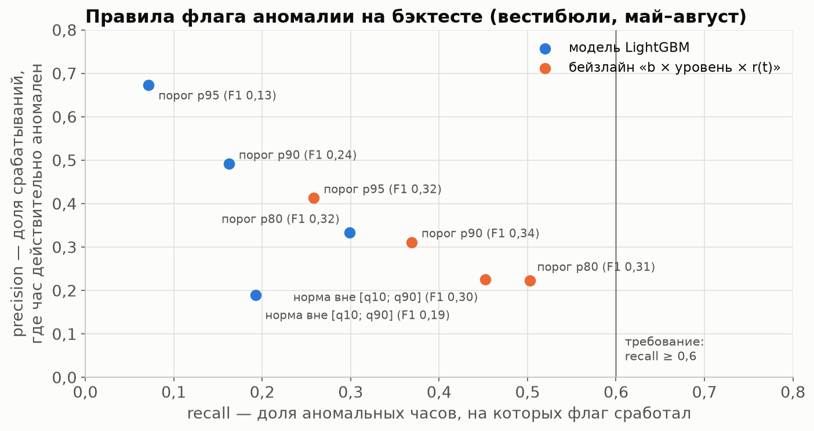{#fig:flags width=88%}

**Правило выбора:** recall ≥ 0,6 и максимальная precision; если такого правила нет — максимальный F1.

- Recall 0,6 не даёт ни одно правило ни у модели, ни у бейзлайна. Поэтому выбран максимальный F1 — **порог p80**.
- На уровне станций (контроль, суммы вестибюлей) порядок тот же: p80 у модели — 0,30 / 0,31 / 0,30.

**Почему флаг слабый.** Он предсказывает аномалию за 1–2 часа *до* неё: провал 31.08 в 08 ч не виден в 07 ч никому.
Модель не переносит отклонение вперёд, поэтому её флаг точнее бейзлайнового (0,33 против 0,22 при p80), но ловит меньше
аномалий.

## Важность признаков {#sec:model-importance}

На @fig:gain — доля суммарного gain q50-бустера финальной модели (фолд «август»).

- **Ведущие признаки:** r линии (17,2 %), r того же часа вчера (13,4 %), r(t) (12,1 %), вестибюль (9,4 %),
  норма b4 (8,4 %), уровень (4,9 %).
- **Дальше — по 2–4 %:** час, лаги, соседи, сглаженные отклонения, накопленное отношение, осадки за 3 ч.

Gain показывает, насколько часто и с какой пользой признак использовался в разбиениях. Это не то же самое, что польза
в абляции: близкие признаки делят gain между собой.

{#fig:gain width=74%}

# Финальный тест {#sec:final}

## Заморозка: почему и как {#sec:freeze}

**Зачем.** Финальный тест — единственная оценка на данных, которые не повлияли ни на одно решение. Если после него
что-то подправить и перезапустить, тест превращается в ещё один фолд для подгонки, и честной оценки не остаётся.
Поэтому сначала модель *замораживается*, и только потом запускается тест — ровно один раз.

**Как устроена заморозка.**

1. **Всё, что определяет модель, записано в `reports/backtest/model_final.json`:** признаки, цель, параметры LightGBM,
   окна ранней остановки и калибровки, ячейки поправки, решение по смеси (не принята), правило флага (порог p80)
   и пороги аномалии без сентября.
2. **В тот же файл записаны два хэша SHA-256.**
   - Хэш конфигурации — `2152d6757c840fd5…`.
   - Хэши пяти файлов кода, от которых зависят модель и признаки: `src/features.py`, `src/model.py`, `src/baseline.py`,
     `src/backtest.py`, `src/eda_spb.py`.
3. **Коммит с тегом `freeze-before-final`.** После тега эти файлы не менялись.
4. **Сам тест — команда `python -m src.model --final`.** Перед запуском она пересчитывает оба хэша и, если что-то
   не совпадает, останавливается. Повторно она тоже не запустится: если файл результатов уже есть, команда откажется
   работать.
5. **До заморозки код теста проверен сухим прогоном** той же функции на фолде «август» — без сентября.

## Результаты как есть

Обучение — по 24.08, тест — 01–29.09, 26 332 строки. Особых дней в сентябре нет. Пороги аномалии — замороженные.

| Модель | WAPE, все часы | t+1 / t+2 | Пики | Аномальные часы | Покрытие q10–q90 |
|:-----------------------------------|---------:|------------------:|--------:|-----------:|----------:|
| Сезонный наивный (неделю назад) | 8,82 % | 8,82 % / 8,82 % | 7,55 % | 13,20 % | 77,0 % |
| Норма b (4 недели) | 11,87 % | 11,87 % / 11,87 % | 11,80 % | 25,12 % | 62,5 % |
| b по 8 неделям | 16,16 % | 16,16 % / 16,16 % | 16,82 % | 27,17 % | 52,4 % |
| b × уровень | 9,89 % | 9,89 % / 9,89 % | 8,76 % | 15,29 % | 62,3 % |
| b × r(t) | 9,73 % | 8,64 % / 10,81 % | 9,39 % | 14,84 % | 67,6 % |
| b × сглаженное r (2 ч) | 10,01 % | 9,11 % / 10,90 % | 9,54 % | 15,43 % | 64,1 % |
| b × уровень × r(t) — лучший на бэктесте | 9,61 % | 8,68 % / 10,55 % | 9,11 % | 14,16 % | 66,8 % |
| **LightGBM, финальная** | **7,72 %** | **7,23 % / 8,21 %** | **7,13 %** | **13,14 %** | **71,7 %** |

: Финальный тест, 1–29 сентября {#tbl:final}

{#fig:ladder width=96%}

**Сравнение с лучшим бейзлайном.** ΔWAPE > 0 означает, что модель лучше; ДИ — блочный бутстреп по дням,
p — тест Диболда–Мариано.

| Период | Бейзлайн | Модель | ΔWAPE, п. п. [95 % ДИ] | p DM |
|:----------------------------|------:|------:|:-------------------:|------:|
| весь сентябрь | 9,61 % | 7,72 % | **+1,89 [+1,57; +2,24]** | < 0,001 |
| 01–14.09 (ступенька уровня) | 12,06 % | 9,77 % | +2,30 [+1,77; +2,86] | < 0,001 |
| 15–29.09 | 7,36 % | 5,84 % | +1,52 [+1,22; +1,95] | < 0,001 |
| аномальные часы | 14,16 % | 13,14 % | +1,02 [+0,16; +1,85] | 0,101 |

: Финальный тест: модель против лучшего бейзлайна {#tbl:final-compare}

**По группам станций** (модель / бейзлайн):

- спальные — 6,84 % / 7,39 %;
- центр и вокзалы — 8,15 % / 10,42 %;
- прочие — 8,59 % / 12,28 %.

Pinball, нормированный на средний поток: 2,57 % у модели против 3,36 % у бейзлайна.

**Флаг аномалии (порог p80).** Фактических аномальных часов 5 630 из 26 332, это 21 %.

- Модель: precision 0,49, recall 0,66, F1 0,56. На станциях — 0,49 / 0,68 / 0,57.
- Бейзлайн: 0,37 / 0,71 / 0,48.

**Калибровка.** Покрытие q10–q90 — 72,6 % на t+1 и 70,9 % на t+2. До поправки было 69,7 % и 66,2 %.

## Разбор

- **Модель держит выигрыш и на сдвиге.** Сентябрь труднее бэктеста: ступенька +13,5 % с 01.09 и новый учебный год.
  WAPE модели вырос с 5,51 % до 7,72 %, но выигрыш у лучшего бейзлайна вырос с 1,16 до 1,89 п. п. Модель лучше
  и в каждой половине месяца, и во всех группах станций.
- **Первые две недели — основная ошибка** (9,77 %). Норма b4 строится по августу и отстаёт на ступеньку. r(t), r линии
  и r вчера её частично подхватывают. Во второй половине месяца, когда норма догнала уровень, ошибка 5,84 % — почти
  как на бэктесте.
- **Сильнее всего выигрыш у прочих станций** (8,59 % против 12,28 %). Именно у них сентябрьская ступенька больше всего:
  +28,3 %, учебный год.
- **Сезонный наивный в сентябре — второй** (8,82 %, лучше всех бейзлайнов от нормы). Неделю назад уже был сентябрьский
  уровень, а норма по 4 неделям его ещё не видит.
- **Аномальных часов в сентябре вдвое больше** (21 % против 10 %). Это почти всё ступенька уровня к августовской норме.
  Здесь модель уже не хуже бейзлайна (13,14 % против 14,16 %, p = 0,101), и её флаг точнее (F1 0,56 против 0,48).
- **Интервал не дотягивает до 80 %:** 71,7 %. Конформная поправка подбиралась на 28.07–24.08, а в сентябре другой
  уровень. Улучшение — пересчитывать поправку по скользящему окну последних 4 недель (@sec:limits).

# Демо и интерпретация {#sec:demo}

## Режим повтора: прогноз «как будто сейчас»

**Что сделали.** `src/serve.py`, функция `forecast(now)`, строит прогноз на любой момент истории так, будто сейчас — это
`now`:

1. **Определяет последний закрытый час.** Час hh считается закрытым в hh:59:

   $$t_0 = \lfloor now + 1\ \text{мин} \rfloor_{\text{час}} - 1\ \text{ч}$$ {#eq:t0}

   При `now = 08:59` берутся данные по 08 ч включительно, а прогноз строится на слоты 09:00 (60 мин) и 10:00 (120 мин).
2. **Обрезает данные.** Поток после t0 становится пропуском, будущие флаги инцидента снимаются.
3. **Пересчитывает всё заново:** нормы, уровень, признаки.
4. **Возвращает три части:** записи по контракту на 18 станций, по три причины на каждую запись и `meta` — какая модель
   ответила и до какой даты обучена.

Ответ — около 2 секунд.

**Как проверено.** Тест подменяет весь поток после t0 случайным шумом. Прогноз, причины и `meta` должны совпасть
полностью — и совпадают. Выход проходит проверку контракта: в дневной час это 36 записей, 18 станций × 2 горизонта.

## Честный выбор модели по дате {#sec:demo-models}

**Проблема.** Модель для эксплуатации обучена на всех данных по 29.09. Если показать ею прогноз на 31.08, её веса уже
видели 31.08 и следующие дни. Такое демо выглядело бы лучше, чем есть на самом деле.

**Что сделали.**

- Сохранили модели фолдов и модель финального теста в одном формате: бустеры, `meta.json`, станционная калибровка.
- По умолчанию (`model="auto"`) `forecast` берёт самую свежую модель, у которой последние сутки обучения плюс 7 суток
  зазора раньше now (@tbl:replay-models).
- Если подходящей модели нет, используется `lgbm_final` с предупреждением «модель видела этот период».

| now | Модель | Обучена по |
|:-----------------|:----------------------|:-------------|
| 30.04 – 30.05 | `lgbm_fold_2026-05` | 23.04 |
| 31.05 – 29.06 | `lgbm_fold_2026-06` | 24.05 |
| 30.06 – 30.07 | `lgbm_fold_2026-07` | 23.06 |
| 31.07 – 30.08 | `lgbm_fold_2026-08` | 24.07 |
| 31.08 – 05.10 | `lgbm_holdout` (модель финального теста) | 24.08 |
| с 06.10 | `lgbm_final` | 29.09 |

: Какая модель отвечает в режиме повтора {#tbl:replay-models}

Тест перебирает моменты now с шагом 7 часов и проверяет: автовыбор никогда не берёт модель, обученную позже
now − 7 суток. Запасная модель выбирается только с предупреждением.

## Кейс 31.08: инцидент и откат спроса {#sec:demo-0831}

На «Чернышевской» 07:50–10:31 была остановка обслуживания. На @fig:demo — Девяткино: прогнозы на 1 и 2 часа модели
и бейзлайна из файлов `model_aug.json` и `baseline_aug.json`. Это модель фолда «август», обученная до 24.07.

{#fig:demo width=100%}

Тот же момент в режиме повтора — `python -m src.serve --now "2026-08-31 08:59"`. Модель выбрана автоматически:
`lgbm_holdout`, обучена по 24.08, вне выборки (@tbl:replay-0831). Факт добавлен для сравнения, `forecast` его не видит.

| Станция | Слот | Горизонт | q10 – **q50** – q90 | Норма | Флаг | Факт |
|:------------------|:-----:|:-----:|:-------------------:|------:|:----:|------:|
| Девяткино | 09:00 | 60 | 6 910 – **7 178** – 7 552 | 8 295 | да | 8 445 |
| Площадь Ленина | 09:00 | 60 | 1 824 – **1 960** – 2 126 | 2 299 | да | 2 750 |
| Чернышевская | 09:00 | 60 | 705 – **758** – 822 | 846 | да | 694 |
| Нарвская | 09:00 | 60 | 1 000 – **1 072** – 1 147 | 957 | да | 1 099 |
| Девяткино | 10:00 | 120 | 4 071 – **4 421** – 4 735 | 5 079 | да | 6 594 |
| Площадь Ленина | 10:00 | 120 | 1 720 – **1 865** – 2 030 | 2 176 | да | 2 643 |
| вся линия | 09:00 | 60 | Σ q50 **38 081** | 39 428 | | 42 467 |
| вся линия | 10:00 | 120 | Σ q50 **28 581** | 29 470 | | 33 019 |

: Режим повтора на 31.08 08:59 {#tbl:replay-0831}

**Что видно.**

- **Сам провал в 08 ч не предсказывает никто:** прогноз на 08 ч сделан до инцидента, и обе модели дают норму.
- **Откат модель ловит, бейзлайн — нет.** В конце 08 ч у Девяткино поток на 75 % ниже нормы.
  - Бейзлайн переносит провал вперёд: на 09 ч — 2 849.
  - Модель даёт 7 178 [6 910; 7 552] при факте 8 445; факт всё же выше интервала.
  - Модель училась без 31.08 и без похожих провалов. Она выучила другое: крайнее отклонение последнего часа
    вместе с провалом всей линии не держится.
- **Нарвская — обратный случай:** в 08 ч ×2,7 к норме. Бейзлайн переносит пик (2 577 на 09 ч), модель — нет
  (1 072 при факте 1 099).
- **Отложенный спрос выше нормы не предсказан:** в 10 ч у Девяткино поток +30 % к норме. Подобных случаев в обучении
  не было.
- **Флаг стоит на всех станциях инцидента** — это сигнал диспетчеру ещё до того, как пришло сообщение об остановке.

## Кейс «Алые паруса», 27.06

`python -m src.serve --now "2026-06-27 20:59"` — вечер перед ночью, когда метро работало до утра. Модель выбрана
автоматически: `lgbm_fold_2026-06`, обучена по 24.05, вне выборки (@tbl:replay-0627).

| Станция | Слот | Горизонт | q10 – **q50** – q90 | Норма | Флаг | Факт |
|:------------------|:-----:|:-----:|:-------------------:|------:|:----:|------:|
| Площадь Восстания | 21:00 | 60 | 5 814 – **6 540** – 8 627 | 5 999 | нет | 6 298 |
| Чернышевская | 21:00 | 60 | 1 820 – **2 047** – 2 700 | 1 912 | нет | 2 106 |
| Площадь Ленина | 21:00 | 60 | 2 127 – **2 393** – 3 156 | 2 082 | нет | 2 929 |
| Девяткино | 21:00 | 60 | 1 888 – **2 093** – 2 633 | 1 617 | да | 2 679 |
| Девяткино | 22:00 | 120 | 1 104 – **1 216** – 1 576 | 988 | да | 2 102 |
| вся линия | 21:00 | 60 | Σ q50 **26 602** | 23 397 | | 31 935 |
| вся линия | 22:00 | 120 | Σ q50 **20 025** | 18 159 | | 25 326 |

: Режим повтора на 27.06 20:59 {#tbl:replay-0627}

**Что видно.**

- Модель видит, что вечер выше нормы: прогноз линии +14 % к норме. Но всплеск она недооценивает — факт +36 %.
- Интервалы здесь шире обычного: верхняя граница — +32 % к q50. Модель «чувствует» неопределённость.
- Это и есть слабое место из ограничений: устойчивый всплеск модель не переносит вперёд целиком. Бейзлайн в этот вечер
  точнее: в таблице особых дней 9,6 % / 11,1 % против 10,7 % / 12,0 % у модели (табл. [-@tbl:full-special]).

## Объяснения для LLM-слоя {#sec:explain}

**Что сделали.** LLM-слою нужно объяснить диспетчеру, *почему* прогноз такой. Для каждого прогноза q50 модель отдаёт
три признака с наибольшим вкладом.

- **Вклады** — разложение предсказания LightGBM на сумму вкладов признаков (`pred_contrib=True`, значения SHAP для
  деревьев). Сумма вкладов и базового значения равна предсказанию z — это проверяет тест.
- **Вклад в процентах:** effect_pct = e^вклад − 1 — во сколько раз признак сдвинул прогноз.
- **Текст** строится по значению признака:
  - «в последний час поток на 75 % ниже нормы»;
  - «вся линия на 25 % ниже нормы»;
  - «соседние станции на 18 % ниже нормы»;
  - «по прогнозу осадки 3,2 мм за 3 ч до 18 ч».

  Признаки нормы, часа и дня недели описаны как поправки модели: «поправка на величину нормы (8 295 входов в 09 ч)».
- **Уровень станции.** Вклады вестибюлей складываются с весом доли вестибюля в q50 станции. Входы суммируются,
  отношения усредняются с тем же весом.

**Пример** — Девяткино, 09:00, t+1, по данным до 08:59:

1. «в последний час поток на 75 % ниже нормы» (−7,1 %);
2. «вся линия на 25 % ниже нормы» (−4,8 %);
3. «поправка на величину нормы (8 295 входов в 09 ч)» (−2,8 %).

**Что попадает в топ-3** по августу:

- r линии, r(t) и r вчера — 61 % всех причин;
- норма — 17 %;
- уровень — 9 %;
- осадки и соседи — по 3 %.

**Альтернативы.** *Важность признаков в целом по модели* не отвечает на вопрос про конкретный час. *LIME* медленнее
и менее стабилен, а для деревьев есть точное и быстрое разложение.

# Ограничения и улучшения {#sec:limits}

**Ограничения.**

- **Аномальные часы.** На бэктесте модель здесь хуже лучшего бейзлайна: 17,95 % против 16,43 %. Она не переносит
  отклонение вперёд целиком, поэтому откат ловит, а устойчивый всплеск («Алые паруса») недооценивает. Смесь с бейзлайном
  улучшала аномальные часы до 16,96 %, но общий WAPE терял 0,06 п. п. при допуске 0,02 — смесь не принята.
- **Сам провал и отложенный спрос выше нормы не предсказываются.** Инцидентов такого масштаба в обучении нет.
- **Интервал на сдвиге уровня.** В сентябре покрытие 71,7 % вместо 80 %: поправка откалибрована на июле–августе.
- **Флаг аномалии принципиально неточен:** на бэктесте F1 0,32 (precision 0,33, recall 0,30), в сентябре — 0,56.
  Он предсказывает аномалию за 1–2 часа до неё.
- **Мало данных.** 9 месяцев, годовой сезонности нет; праздников в обучении 7, сокращённых дней 3. Правило абляции
  «3 фолда из 4» не видит редкие признаки.
- **Гиперпараметры не подбирались.** Результаты получены для одного набора параметров и одного seed.
- **Только входы.** Пересадок и направлений в данных нет, поэтому оценка ёмкости грубая. «Технологический институт»
  не прогнозируется — его нет в данных.
- **Режим повтора.** Для дат до 30.04 подходящей модели вне выборки нет; используется модель, видевшая этот период,
  с предупреждением.

**Улучшения.**

- **Особые дни.** Вернуть группу, когда в обучении будет не меньше 4 сокращённых дней. На 8.05 и 11.06 она давала
  +0,74 п. п. [0,00; +1,45]. Следующий сокращённый день — 3.11, перед 4.11.
- **Скользящая калибровка.** Пересчитывать конформную поправку и квантили станций по последним 4 неделям перед каждым
  днём прогноза — это закроет недопокрытие на сдвиге уровня.
- **Смесь только для устойчивых отклонений.** Вес смеси — по длительности отклонения, а не по его величине.
- **10-минутные данные АСКОП М.** Система их умеет; с ними можно прогнозировать на 15–60 минут и раньше видеть провал.
  Контракт уже допускает 15-минутные слоты.
- **Журнал инцидентов и событий.** С подтверждёнными инцидентами и расписанием событий можно учить реакцию на них,
  а не только откат.
- **Подбор гиперпараметров** на отложенном окне и **CatBoost MultiQuantile** как альтернатива.

# Что передано команде {#sec:handover}

| Что | Где | Как использовать |
|:----------------------------|:----------------------------------|:-------------------------------------------|
| Контракт выхода | `src/contract.py`, `data/predictions/contract.schema.json`, `stub.json` | проверка формата на любом языке; заглушка на 12.11.2026 |
| Прогнозы на август | `data/predictions/model_aug.json`, `baseline_aug.json`, `model_aug_explain.json` | 22 320 записей: 18 станций × 31 день × 20 слотов × 2 горизонта; не в git, собираются командами |
| Прогноз «как будто сейчас» | `src/serve.py`: `forecast(now)` | данные только до now; записи, причины, `meta` |
| Модели | `models/lgbm_fold_*`, `lgbm_holdout`, `lgbm_final` | не в git; собираются за 5 минут (приложение [-@sec:app-repro]) |
| Документация | `README.md`, `docs/model_card.md`, `docs/backtest.md` | установка, команды, формат выхода; карточка модели на одну страницу |
| Графики для презентации | `reports/figures/spb_13_lgbm_gain.png`, `spb_14_wape_ladder.png`, `spb_15_demo_0831.png` | подписи по-русски |

: Что передано команде {#tbl:handover}

**Как получить прогноз** (подробно — в README):

```bash
python -m src.serve --now "2026-08-31 08:59"
python -m src.serve --now "2026-08-31 08:59" --stations devyatkino,narvskaya --json forecast.json
```

Из Python, например в Streamlit:

```python
from src import serve
fc = serve.forecast("2026-08-31 08:59")   # модель выбирается автоматически
fc.records, fc.explanations, fc.meta       # контракт, причины, сведения о модели
serve.table(fc)                            # всё одной таблицей
```

**Открытые вопросы к команде:**

- **Роль 4.** Флаг p80 в сентябре даёт precision 0,49 при recall 0,66. Хватает ли этого для рекомендаций или нужен
  отдельный детектор по факту текущего часа?
- **Роль 3.** `forecast` пересчитывает нормы на каждый вызов (около 2 с). В приложении стоит кэшировать результат
  по `now`.

```{=latex}
\startappendix
```

# Глоссарий {#sec:app-glossary label="А"}

Термины в алфавитном порядке: что это простыми словами и зачем в проекте.

**Абляция**
: Проверка пользы частей модели: группы признаков добавляют по одной (или убирают по одной) и смотрят, как меняется
  ошибка. *Зачем:* решить, какие группы признаков оставить (@sec:model-ablation, @sec:model-loo).

**Аномальный час**
: Час, в котором поток отклонился от нормы сильнее обычного: |r − 1| выше p95 своей группы станций и периода суток.
  *Зачем:* отдельный срез метрик и «факт» для проверки флага аномалии.

**АСКОП М**
: Автоматизированная система учёта проходов метрополитена — источник данных турникетов. Умеет выгружать данные
  с шагом 10 минут. *Зачем:* основа всех данных; 10-минутная выгрузка — главное улучшение (@sec:limits).

**Бейзлайн (базовая модель)**
: Простой прогноз без обучения, например «тот же час неделю назад» или «норма × текущее отклонение». *Зачем:* планка,
  которую модель обязана побить; без неё нельзя сказать, хороша ли модель.

**Блочный бутстреп по дням**
: Бутстреп, в котором перевыбираются не отдельные часы, а целые дни. *Зачем:* часы одного дня зависимы; обычный бутстреп
  дал бы слишком узкие доверительные интервалы.

**Бустинг градиентный**
: Метод, который строит много небольших деревьев решений подряд; каждое следующее исправляет ошибки суммы предыдущих.
  *Зачем:* основа модели — сильный метод для табличных данных со взаимодействиями признаков.

**Бутстреп**
: Оценка неопределённости повторным выбором с возвращением из имеющихся данных: метрику пересчитывают на 1 000 таких
  выборок и смотрят её разброс. *Зачем:* доверительные интервалы для ΔWAPE и эффектов признаков.

**Вестибюль**
: Отдельный вход на станцию со своими турникетами. На 1 линии 23 вестибюля и 18 станций с данными. *Зачем:* модель
  работает по вестибюлям — у них разный режим и разная реакция на инцидент.

**Доверительный интервал (ДИ)**
: Диапазон, в котором с заданной уверенностью (здесь 95 %) лежит истинное значение величины. *Зачем:* показать,
  что выигрыш модели не случаен: если ДИ для ΔWAPE целиком выше нуля, модель лучше.

**Зазор**
: Промежуток между концом обучения и началом теста, здесь 7 суток. *Зачем:* признаки смотрят в прошлое до недели,
  и без зазора тест был бы слишком похож на последние дни обучения.

**Заморозка модели**
: Фиксация конфигурации и кода перед финальным тестом: признаки, параметры и правила записаны в файл, посчитаны их хэши,
  поставлен тег в git. *Зачем:* финальный тест должен быть честным — после него ничего не подстраивается (@sec:freeze).

**Исторический прогноз погоды**
: Прогноз, который был доступен *до* наступления часа, а не фактическая погода. *Зачем:* признак погоды должен быть
  известен в момент прогноза, иначе это утечка.

**Квантиль**
: Значение, ниже которого лежит заданная доля наблюдений. Квантиль 0,9 (q90) — значение, которое факт превышает
  в 10 % случаев. *Зачем:* модель отдаёт q10, q50, q90 — медиану и интервал неопределённости.

**Квантильная регрессия**
: Модель, которая предсказывает не среднее, а квантиль; обучается на функции потерь pinball. *Зачем:* прогноз
  интервала без предположений о форме распределения ошибок (@sec:model-lgbm).

**Конформная калибровка**
: Поправка интервала по ошибкам модели на данных, которых она не видела: интервал расширяют или сужают так, чтобы
  доля попаданий была нужной. *Зачем:* сырые квантили LightGBM покрывают 73 % вместо 80 %.

**Контракт выхода**
: Общий для команды формат прогноза (поля, типы, правила проверки) в виде схемы. *Зачем:* части системы разрабатываются
  параллельно и стыкуются по контракту (@sec:contract).

**Корреляция Спирмена**
: Корреляция рангов: насколько согласованно растут две величины, без требования линейной связи. *Зачем:* отбор
  признаков, синхронность станций, проверка признаков на связь со временем.

**Корреляция Спирмена стратифицированная**
: Корреляция Спирмена, посчитанная внутри однородных групп (здесь слот «вестибюль × час»). *Зачем:* суточный профиль
  и размер вестибюля не создают ложной связи признака с целью.

**LightGBM**
: Быстрая реализация градиентного бустинга на деревьях; работает с пропусками и категориями. *Зачем:* основная модель
  проекта.

**LLM-слой**
: Часть системы на большой языковой модели, которая объясняет диспетчеру прогноз и рекомендацию словами. *Зачем:*
  получает от ML три причины прогноза (@sec:explain).

**MAE**
: Средняя абсолютная ошибка в пассажирах. *Зачем:* дополнительная метрика, понятная в штуках.

**Множественные сравнения**
: Проблема многих проверок: при 112 тестах на уровне 5 % около 5–6 «значимых» результатов появятся случайно. *Зачем:*
  отбор признаков проверял 56 кандидатов × 2 горизонта, поэтому нужна поправка.

**Норма (b, b4)**
: «Сколько обычно входит в этот час»: медиана того же вестибюля, часа и дня недели по 4 последним обычным таким же дням.
  *Зачем:* самостоятельный прогноз, опора цели модели и поле `baseline` в контракте (@sec:norms).

**Обычный день**
: День, тип которого совпадает с днём недели (не праздник и не перенос), не 1–11 января и не день события. *Зачем:*
  в норму идут только обычные дни.

**Особая ночь**
: Ночь, когда метро работало в часы, когда обычно закрыто: Новый год, Рождество, 29→30.05, «Алые паруса». *Зачем:*
  вечера перед ними — особые дни, они исключены из обучения и считаются отдельно.

**Особый день**
: День, который не должен учить модель и не входит в общие метрики: инцидент 31.08 и вечера перед особыми ночами
  29.05 и 27.06. *Зачем:* по ним — отдельная таблица и демо-кейсы.

**Отклонение (r)**
: Отношение потока к норме: r = y / b. r = 1,2 — поток на 20 % выше обычного. *Зачем:* главный сигнал модели —
  отклонение держится 2–3 часа.

**p-value**
: Вероятность получить такой же или более сильный эффект, если на самом деле связи нет. Маленькое p (меньше 0,05) —
  довод, что эффект не случаен. *Зачем:* отбор признаков, сравнение моделей тестом Диболда–Мариано.

**Парность**
: Число пар поездов в час на линии (максимум 32). *Зачем:* им управляют рекомендации; провозная способность —
  парность × вместимость состава.

**Переобучение**
: Модель запоминает обучающие данные вместе с шумом и хуже работает на новых. *Зачем:* против него — ранняя остановка,
  минимальный размер листа, регуляризация, проверка на отложенных данных.

**Перестановочный тест**
: Проверка значимости: связь признака с целью разрушают, переставляя данные, и смотрят, как часто случайная связь
  получается не слабее настоящей. Здесь переставляются целые дни внутри месяца и типа дня. *Зачем:* p-value без
  предположений о распределении.

**Pinball loss**
: Функция потерь квантиля (@eq:pinball): для q90 недооценка штрафуется в 9 раз сильнее переоценки. *Зачем:* обучение
  квантильных моделей и оценка качества интервала.

**Покрытие интервала**
: Доля часов, в которых факт попал в интервал [q10; q90]; цель — 80 %. *Зачем:* проверка, что интервалу можно верить.

**Поправка Бенджамини–Хохберга (BH)**
: Поправка p-value при множественных сравнениях, которая ограничивает долю ложных открытий среди найденных.
  *Зачем:* отбор признаков из 112 проверок.

**Precision, recall, F1**
: Для флага аномалии:
  - precision — доля срабатываний, где час действительно аномален;
  - recall — доля аномальных часов, где флаг сработал;
  - F1 — их гармоническое среднее.

  *Зачем:* выбор правила флага (@sec:model-flag).

**Провозная способность**
: Сколько пассажиров линия может перевезти за час в одном направлении: парность × вместимость (32 × 1 458 = 46,7 тыс.).
  *Зачем:* грубая оценка загрузки и вход для симулятора.

**Производственный календарь**
: Официальный список рабочих и нерабочих дней с переносами выходных. *Зачем:* тип дня и норма для праздников;
  перенесённые выходные сильно меняют поток.

**Ранняя остановка**
: Обучение бустинга прекращается, когда ошибка на отложенной выборке перестаёт падать. *Зачем:* выбрать число деревьев
  и не переобучиться; отложенная выборка — последние 2 недели обучения, не тест.

**Расширяющееся окно**
: Схема бэктеста, в которой каждый следующий фолд обучается на всей истории до него. *Зачем:* при 9 месяцах данных не
  терять ранние месяцы и повторить эксплуатацию, где модель переобучают на всей истории.

**Режим повтора**
: Прогноз на любой исторический момент «как будто сейчас»: данные после этого момента не используются. *Зачем:* демо
  на дашборде и проверка кейсов (@sec:demo).

**Сезонный наивный прогноз**
: «Как в тот же час неделю назад». *Зачем:* самый простой бейзлайн, нижняя ступень лестницы.

**Сглаживание экспоненциальное**
: Среднее, в котором недавние значения весят больше, а вес старых падает вдвое за время *полупериода* (здесь 2 и 6 ч).
  *Зачем:* «сглаженное отклонение» — устойчивый уровень «сегодня выше нормы» без часового шума.

**Сутки метро**
: Сутки с 05:00 до 04:59 следующего дня; час 00 относится к прошедшим суткам. *Зачем:* так устроена выгрузка, и так
  считаются нормы, накопленные суммы и «вчера».

**Тест Диболда–Мариано (DM)**
: Статистический тест, есть ли разница в точности двух прогнозов на одних и тех же данных; учитывает автокорреляцию
  ошибок (оценка дисперсии Ньюи–Уэста). *Зачем:* проверить, что выигрыш модели у бейзлайна значим.

**Уровень (поправка на уровень)**
: Медиана отношения суточного потока к норме по 7 последним обычным суткам. *Зачем:* норма по 4 неделям отстаёт от
  тренда; уровень это отставание закрывает.

**Утечка данных**
: Использование в признаках информации, недоступной в момент прогноза, например потока следующего часа. Модель с утечкой
  отлично выглядит на проверке и бесполезна в работе. *Зачем:* тесты на утечку — обязательная часть проекта.

**Фолд**
: Одно разбиение «обучение — тест» в бэктесте. *Зачем:* 4 фолда (май–август) дают 4 независимые оценки качества.

**Флаг (строки)**
: Пометка часа, который не описывает спрос: метро закрыто, вестибюль закрыт, инцидент. *Зачем:* такие часы исключены
  из целей и метрик (@sec:flags).

**Флаг аномалии (`is_anomaly`)**
: Поле контракта: прогноз отклоняется от нормы сильнее порога p80 группы и периода. *Зачем:* сигнал диспетчеру
  и рекомендациям.

**CQR (конформная квантильная регрессия)**
: Конформная калибровка для квантильных моделей: нижний и верхний квантили сдвигаются на квантили ошибок,
  посчитанных на отложенных данных (@eq:cqr). *Зачем:* интервал с нужным покрытием.

**DST (летнее время)**
: Переход на летнее и зимнее время; в Нью-Йорке в ноябре час 01:00 бывает дважды. *Зачем:* урок MTA — сетка в UTC,
  строки с переводом часов исключаются.

**SHAP-вклады (`pred_contrib`)**
: Разложение предсказания дерева на сумму вкладов признаков. *Зачем:* топ-3 причины прогноза для LLM-слоя.

**WAPE**
: Взвешенная абсолютная процентная ошибка: сумма абсолютных ошибок, делённая на суммарный поток (@eq:wape). *Зачем:*
  главная метрика — ошибка в часы большого потока весит больше.

**Хэш (SHA-256)**
: Короткий «отпечаток» файла: изменение хотя бы одного символа меняет хэш. *Зачем:* доказать, что модель и код
  не менялись после заморозки.

# Обозначения {#sec:app-symbols label="Б"}

| Символ | Что это | Формула или определение |
|:---------------|:--------------------------------------|:----------------------------------------------|
| y, y(t) | входы вестибюля за час | наблюдённый поток; в закрытые часы — пропуск |
| t | исходный час: прогноз делается в его конце | — |
| h | горизонт, часов | 1 или 2; `horizon_min` = 60·h |
| τ | час, на который прогноз | τ = t + h |
| b, b4 | норма | медиана y того же вестибюля, часа и дня недели по 4 последним обычным таким же суткам (для праздников — по воскресеньям) |
| b8 | норма по 8 неделям | то же по 8 суткам |
| $\text{уровень}_7$ | поправка на уровень | медиана Σy/Σb4 по суткам за 7 последних обычных суток до дня τ, в пределах [0,5; 2] |
| $f_{\text{ref}}$ | опорная норма модели | $f_{\text{ref}} = b_4 \cdot \text{уровень}_7$ (@eq:norm) |
| r(t) | отклонение | r = y / f_ref (в часы 06–00 при f_ref ≥ 20; признаки модели) или y / b (EDA) |
| Σy/Σf | накопленное отношение | Σ y / Σ f_ref с 05:00 суток метро по конец часа t |
| r_линии | отклонение всей линии | Σ_v y_v / Σ_v f_ref,v по вестибюлям, где r определён |
| z | цель модели | z = log((y + 1)/(f_ref + 1)) (@eq:target) |
| q10, q50, q90 | квантили прогноза | $\hat y_q = (f_{\text{ref}} + 1)\,e^{\hat z_q} - 1$, затем поправка и сортировка |
| α | уровень квантиля | 0,1; 0,5; 0,9 |
| L_α | pinball loss | max(α(y − q), (α − 1)(y − q)) (@eq:pinball) |
| W, C, E | окна внутри обучения | W — всё обучение; C — последние 28 суток; E — последние 14 суток |
| c_lo, c_hi | конформные поправки | квантили ошибок отложенной модели на C (@eq:cqr) |
| WAPE | взвешенная ошибка | Σ\|y − q50\| / Σy (@eq:wape) |
| ΔWAPE | выигрыш | WAPE(база сравнения) − WAPE(новая модель); > 0 — новая лучше |
| w, a, w_max | смесь с бейзлайном | w = clip(a·\|r_линии − 1\|, 0, w_max) (@eq:blend) |
| now, $t_0$ | момент прогноза и последний закрытый час | $t_0 = \lfloor now + 1\ \text{мин} \rfloor_{\text{час}} - 1\ \text{ч}$ (@eq:t0) |
| p80, p90, p95 | квантили \|r − 1\| | пороги шума и аномалии по группе станций и периоду суток |

: Обозначения {#tbl:symbols}

# Признаки финальной модели {#sec:app-features label="В"}

Все признаки — по данным до конца часа t. Признаки часа τ — норма, календарь, прогноз погоды — известны заранее.
Лаги потока у τ — не ближе τ − 24.

| Имя в коде | Группа | Формула | Смысл |
|:---------------|:--------|:------------------------------------|:-------------------------------------|
| `vestibule` | база | категория | вестибюль: своя норма реакции |
| `station_group` | база | категория: спальные / центр / прочие | тип станции |
| `hour_tau` | база | час τ, 00 → 24 | сутки метро идут по порядку |
| `dow_tau` | база | день недели суток τ | недельный цикл |
| `day_type_tau` | база | категория: рабочий / суббота / воскресенье / праздник | праздник и перенос |
| `h` | база | 1 или 2 | горизонт |
| `b4_tau` | база | b4(τ) | норма на час τ |
| `level` | база | $\text{уровень}_7$ на сутки τ | уровень последней недели |
| `y_t`, `y_t1` | база | y(t), y(t − 1) | поток последних часов |
| `y_tau24`, `y_tau168` | база | y(τ − 24), y(τ − 168) | вчера и неделю назад в тот же час |
| `r_t` | ядро | y(t)/f_ref(t) | отклонение в последний час |
| `ewm_r_2h`, `ewm_r_6h` | ядро | экспоненциальное среднее r, полупериод 2 и 6 ч | устойчивое отклонение |
| `cum_ratio` | ядро | Σy/Σf_ref с 05:00 до t | «с открытия вошло на N % больше обычного» |
| `ratio_168` | ядро | (y(t) + 1)/(y(t − 168) + 1) | против того же часа неделю назад |
| `r_line` | кросс | Σ_v y / Σ_v f_ref в час t | фон всей линии |
| `ewm_r_line_2h` | кросс | экспоненциальное среднее r_линии, 2 ч | сглаженный фон линии |
| `r_neighbors` | кросс | среднее r станций в пределах ±2 по линии, без своей | местная часть |
| `r_twin` | кросс | r второго вестибюля станции | перераспределение между входами |
| `share_dev` | кросс | r_t / r_line | доля вестибюля в линии против обычной |
| `r_yday` | вчера | r(τ − 24) | отклонение в тот же час вчера |
| `cum_ratio_yday` | вчера | Σy/Σf_ref прошлых суток метро | каким был вчерашний день |
| `fc_precip_tau` | погода | 1{прогноз осадков в τ ≥ 0,5 мм/ч} | дождь по прогнозу |
| `fc_precip_3h_tau` | погода | Σ прогноза осадков за τ − 2…τ, мм | осадки перед часом τ |

: 26 признаков финальной модели {#tbl:features-full}

**Отброшены абляцией:**

- *скорость и ускорение* — `excess_d1_rel`, `excess_d2_rel`, `excess_d3_rel` = [(y(t) − y(t − k)) − (f(t) − f(t − k))] / f(t),
  а также `dr2`, `dr3` = r(t) − r(t − k);
- *особые дни* — `shortened_14_16`, `shortened_17_19` (сокращённый день в эти часы), `night_ahead_late` (23–00 перед
  особой ночью).

# Полные таблицы результатов {#sec:app-tables label="Г"}

Источники — `reports/backtest/*.csv`. WAPE и покрытие — среднее по t+1 и t+2, если не сказано иное; значения в %.

```{=latex}
\begin{landscape}
```

| Модель | Все часы | t+1 | t+2 | Пики | Аномальные | Праздники | Спальные | Центр | Прочие | Покрытие | Pinball, норм. |
|:------------------------------|--------:|-------:|-------:|-------:|-----------:|----------:|---------:|-------:|-------:|---------:|---------:|
| Сезонный наивный | 10,01 | 10,01 | 10,01 | 9,29 | 33,70 | 57,12 | 9,13 | 10,39 | 11,00 | 77,5 | 3,77 |
| Норма b4 | 7,59 | 7,59 | 7,59 | 6,35 | 26,37 | 14,93 | 6,67 | 8,12 | 8,37 | 70,1 | 2,60 |
| Норма b8 | 8,97 | 8,97 | 8,97 | 7,91 | 26,66 | 15,35 | 7,91 | 9,11 | 10,84 | 64,0 | 3,14 |
| b4 × уровень | 6,83 | 6,83 | 6,83 | 5,59 | 24,07 | 15,47 | 6,05 | 7,69 | 6,67 | 75,4 | 2,33 |
| b4 × r(t) | 6,70 | 6,29 | 7,11 | 5,79 | 16,55 | 13,01 | 5,41 | 7,68 | 7,29 | 77,6 | 2,28 |
| b4 × сглаж. r (2 ч) | 6,86 | 6,31 | 7,42 | 6,24 | 18,36 | 13,99 | 6,27 | 7,36 | 7,04 | 76,3 | 2,32 |
| b4 × уровень × r(t) | 6,66 | 6,28 | 7,05 | 5,74 | 16,43 | 13,03 | 5,33 | 7,68 | 7,28 | 78,2 | 2,27 |
| LGBM: база | 6,64 | 6,60 | 6,68 | 5,46 | 23,24 | 14,37 | 5,85 | 7,40 | 6,69 | 77,6 | 2,25 |
| + ядро динамики | 5,85 | 5,69 | 6,00 | 4,85 | 19,51 | 13,04 | 4,99 | 6,60 | 6,04 | 79,5 | 1,94 |
| + кросс | 5,66 | 5,45 | 5,88 | 4,73 | 18,48 | 12,58 | 4,78 | 6,45 | 5,84 | 80,1 | 1,88 |
| + скорость (отброшена) | 5,67 | 5,44 | 5,89 | 4,72 | 18,40 | 12,66 | 4,78 | 6,44 | 5,85 | 79,9 | 1,88 |
| + вчера | 5,54 | 5,36 | 5,72 | 4,51 | 18,34 | 12,77 | 4,64 | 6,34 | 5,70 | 80,2 | 1,83 |
| **+ погода — финальная** | **5,51** | **5,33** | **5,68** | **4,50** | 17,95 | 12,65 | 4,59 | 6,34 | 5,67 | 80,3 | 1,83 |
| + особые дни (отброшена) | 5,49 | 5,32 | 5,66 | 4,50 | 17,76 | 12,64 | 4,59 | 6,31 | 5,64 | 80,2 | 1,82 |
| полный набор, цель-отношение | 5,49 | 5,32 | 5,66 | 4,51 | 17,67 | 12,73 | 4,59 | 6,30 | 5,65 | 80,0 | 1,82 |
| полный набор, цель log1p(y) | 5,76 | 5,60 | 5,91 | 4,97 | 17,35 | 11,64 | 5,14 | 6,31 | 5,86 | 80,0 | 1,91 |

: Бэктест, май–август: все модели по срезам {#tbl:full-backtest}

| Модель | Все часы | t+1 | t+2 | Пики | Аномальные | Спальные | Центр | Прочие | Покрытие | Pinball, норм. |
|:------------------------------|--------:|-------:|-------:|-------:|-----------:|---------:|-------:|-------:|---------:|---------:|
| Сезонный наивный | 8,82 | 8,82 | 8,82 | 7,55 | 13,20 | 7,76 | 9,75 | 9,10 | 77,0 | 3,09 |
| Норма b4 | 11,87 | 11,87 | 11,87 | 11,80 | 25,12 | 9,96 | 11,88 | 15,37 | 62,5 | 4,47 |
| Норма b8 | 16,16 | 16,16 | 16,16 | 16,82 | 27,17 | 13,55 | 15,23 | 22,60 | 52,4 | 6,23 |
| b4 × уровень | 9,89 | 9,89 | 9,89 | 8,76 | 15,29 | 8,70 | 10,30 | 11,36 | 62,3 | 3,45 |
| b4 × r(t) | 9,73 | 8,64 | 10,81 | 9,39 | 14,84 | 7,77 | 10,46 | 12,04 | 67,6 | 3,42 |
| b4 × сглаж. r (2 ч) | 10,01 | 9,11 | 10,90 | 9,54 | 15,43 | 9,24 | 10,08 | 11,29 | 64,1 | 3,57 |
| b4 × уровень × r(t) | 9,61 | 8,68 | 10,55 | 9,11 | 14,16 | 7,39 | 10,42 | 12,28 | 66,8 | 3,36 |
| **LightGBM, финальная** | **7,72** | **7,23** | **8,21** | **7,13** | **13,14** | **6,84** | **8,15** | **8,59** | 71,7 | 2,57 |

: Финальный тест, сентябрь: все модели по срезам (праздников в сентябре нет) {#tbl:full-final}

```{=latex}
\end{landscape}
```

| Модель | май | июнь | июль | август |
|:-----------------------------------|-----:|-----:|-----:|-----:|
| Сезонный наивный | 14,09 | 10,32 | 7,65 | 7,79 |
| Норма b4 | 6,88 | 7,68 | 8,52 | 7,24 |
| Норма b8 | 7,05 | 8,90 | 11,33 | 8,54 |
| b4 × уровень | 6,95 | 7,25 | 6,53 | 6,57 |
| b4 × r(t) | 7,20 | 7,20 | 6,37 | 5,96 |
| b4 × сглаж. r (2 ч) | 7,39 | 7,65 | 6,52 | 5,79 |
| b4 × уровень × r(t) | 7,24 | 7,17 | 6,25 | 5,92 |
| LGBM: база | 6,81 | 6,84 | 6,30 | 6,62 |
| + ядро динамики | 6,29 | 6,07 | 5,46 | 5,54 |
| + кросс | 6,20 | 5,81 | 5,31 | 5,31 |
| + скорость (отброшена) | 6,21 | 5,80 | 5,35 | 5,28 |
| + вчера | 6,11 | 5,67 | 5,23 | 5,10 |
| **+ погода — финальная** | **6,07** | **5,64** | **5,23** | **5,05** |
| + особые дни (отброшена) | 6,07 | 5,56 | 5,24 | 5,06 |
| полный набор, цель-отношение | 6,08 | 5,55 | 5,24 | 5,06 |
| полный набор, цель log1p(y) | 6,16 | 5,74 | 5,67 | 5,42 |

: Бэктест: WAPE по фолдам, все часы {#tbl:full-folds}

| Шаг абляции | ΔWAPE по фолдам: май / июнь / июль / август, п. п. | К лучшему бейзлайну, п. п. [95 % ДИ] | p DM | Покрытие до → после поправки |
|:--------------------------|:-----------------------------:|:-----------------------:|------:|:---------------:|
| база | — | +0,02 [−0,26; +0,27] | 0,911 | 70,2 → 77,6 |
| + ядро динамики | +0,52 / +0,77 / +0,84 / +1,08 | +0,82 [+0,68; +0,94] | < 0,001 | 72,5 → 79,5 |
| + кросс | +0,09 / +0,26 / +0,15 / +0,23 | +1,00 [+0,87; +1,14] | < 0,001 | 72,7 → 80,1 |
| + скорость и ускорение | −0,01 / +0,01 / −0,04 / +0,03 | +1,00 [+0,86; +1,14] | < 0,001 | 72,5 → 79,9 |
| + вчера | +0,09 / +0,13 / +0,08 / +0,21 | +1,13 [+1,00; +1,26] | < 0,001 | 73,4 → 80,2 |
| + погода | +0,04 / +0,03 / +0,00 / +0,05 | **+1,16 [+1,02; +1,30]** | < 0,001 | 73,4 → 80,3 |
| + особые дни | +0,00 / +0,08 / −0,01 / −0,01 | +1,17 [+1,03; +1,34] | < 0,001 | 73,3 → 80,2 |
| полный набор, цель-отношение | — | +1,17 [+1,02; +1,35] | < 0,001 | 72,9 → 80,0 |
| полный набор, цель log1p(y) | — | +0,91 [+0,75; +1,08] | < 0,001 | 71,9 → 80,0 |

: Абляция: ΔWAPE по фолдам и сравнение с лучшим бейзлайном {#tbl:full-ablation}

| Фолд | h | Обучение | Окно C | Деревьев q10 / q50 / q90 | Покрытие на C: до → после | На тесте: до → после |
|:--------|:-:|:------------|:------------|:---------------:|:---------------:|:---------------:|
| май | 1 | 09.02–23.04 | 27.03–23.04 | 67 / 94 / 146 | 71,1 → 80,2 | 70,6 → 77,7 |
| май | 2 | 09.02–23.04 | 27.03–23.04 | 67 / 94 / 146 | 71,1 → 80,2 | 68,9 → 77,1 |
| июнь | 1 | 09.02–24.05 | 27.04–24.05 | 139 / 389 / 79 | 69,2 → 80,2 | 74,2 → 83,3 |
| июнь | 2 | 09.02–24.05 | 27.04–24.05 | 139 / 389 / 79 | 69,2 → 80,2 | 70,7 → 82,3 |
| июль | 1 | 09.02–23.06 | 27.05–23.06 | 370 / 1400 / 237 | 72,3 → 80,2 | 76,2 → 82,0 |
| июль | 2 | 09.02–23.06 | 27.05–23.06 | 370 / 1400 / 237 | 72,3 → 80,2 | 74,3 → 82,2 |
| август | 1 | 09.02–24.07 | 27.06–24.07 | 171 / 288 / 501 | 74,8 → 80,2 | 77,0 → 79,3 |
| август | 2 | 09.02–24.07 | 27.06–24.07 | 171 / 288 / 501 | 74,8 → 80,2 | 74,9 → 78,7 |
| сентябрь | 1 | 09.02–24.08 | 28.07–24.08 | 412 / 356 / 150 | 77,2 → 80,2 | 69,7 → 72,6 |
| сентябрь | 2 | 09.02–24.08 | 28.07–24.08 | 412 / 356 / 150 | 77,2 → 80,2 | 66,2 → 70,9 |

: Калибровка финальной модели по фолдам и в финальном тесте {#tbl:full-calib}

| Модель | Уровень | Правило | Факт | Флагов | Precision | Recall | F1 |
|:---------|:----------|:---------------------|------:|------:|-----:|-----:|-----:|
| модель | вестибюли | порог p80 | 10 996 | 9 853 | 0,33 | 0,30 | 0,32 |
| модель | вестибюли | порог p90 | 10 996 | 3 635 | 0,49 | 0,16 | 0,24 |
| модель | вестибюли | порог p95 | 10 996 | 1 172 | 0,67 | 0,07 | 0,13 |
| модель | вестибюли | норма вне [q10; q90] | 10 996 | 11 152 | 0,19 | 0,19 | 0,19 |
| модель | станции | порог p80 | 7 362 | 7 410 | 0,30 | 0,31 | 0,30 |
| модель | станции | порог p90 | 7 362 | 2 631 | 0,47 | 0,17 | 0,25 |
| модель | станции | порог p95 | 7 362 | 848 | 0,64 | 0,07 | 0,13 |
| модель | станции | норма вне [q10; q90] | 7 362 | 8 877 | 0,15 | 0,19 | 0,17 |
| бейзлайн | вестибюли | порог p80 | 10 996 | 24 782 | 0,22 | 0,50 | 0,31 |
| бейзлайн | вестибюли | порог p90 | 10 996 | 13 039 | 0,31 | 0,37 | 0,34 |
| бейзлайн | вестибюли | порог p95 | 10 996 | 6 882 | 0,41 | 0,26 | 0,32 |
| бейзлайн | вестибюли | норма вне [q10; q90] | 10 996 | 22 044 | 0,23 | 0,45 | 0,30 |
| бейзлайн | станции | порог p80 | 7 362 | 17 956 | 0,21 | 0,51 | 0,29 |
| бейзлайн | станции | порог p90 | 7 362 | 8 987 | 0,30 | 0,37 | 0,33 |
| бейзлайн | станции | порог p95 | 7 362 | 4 478 | 0,41 | 0,25 | 0,31 |
| бейзлайн | станции | норма вне [q10; q90] | 7 362 | 15 724 | 0,21 | 0,44 | 0,28 |

: Флаг аномалии на бэктесте: все правила, оба горизонта {#tbl:full-flags}

| Модель | Уровень | Правило | Факт | Флагов | Precision | Recall | F1 |
|:---------|:----------|:---------------------|------:|------:|-----:|-----:|-----:|
| модель | вестибюли | **порог p80 (выбран)** | 5 630 | 7 582 | 0,49 | 0,66 | 0,56 |
| модель | вестибюли | порог p90 | 5 630 | 5 031 | 0,59 | 0,52 | 0,55 |
| модель | вестибюли | порог p95 | 5 630 | 3 277 | 0,69 | 0,40 | 0,51 |
| модель | вестибюли | норма вне [q10; q90] | 5 630 | 7 551 | 0,45 | 0,61 | 0,52 |
| модель | станции | **порог p80 (выбран)** | 4 278 | 5 921 | 0,49 | 0,68 | 0,57 |
| бейзлайн | вестибюли | порог p80 | 5 630 | 10 824 | 0,37 | 0,71 | 0,48 |
| бейзлайн | станции | порог p80 | 4 278 | 8 425 | 0,36 | 0,72 | 0,48 |

: Флаг аномалии в финальном тесте (сентябрь) {#tbl:full-flags-sep}

| День | Модель | WAPE t+1 | WAPE t+2 | Покрытие t+1 / t+2 |
|:-----------------------------|:----------------------|--------:|--------:|---------------:|
| 29.05, вечер перед ночью до утра | Норма b4 | 5,8 | 5,8 | 71,6 / 71,6 |
| | b4 × уровень | 5,9 | 5,9 | 77,3 / 77,3 |
| | b4 × уровень × r(t) | 6,4 | 7,0 | 75,1 / 75,3 |
| | **LightGBM, финальная** | **4,8** | **5,2** | 78,4 / 79,1 |
| 27.06, «Алые паруса» | Норма b4 | 15,2 | 15,2 | 51,1 / 51,1 |
| | b4 × уровень | 14,2 | 14,2 | 53,3 / 53,3 |
| | b4 × уровень × r(t) | **9,6** | **11,1** | 68,1 / 63,4 |
| | LightGBM, финальная | 10,7 | 12,0 | 75,1 / 71,6 |
| 31.08, инцидент (часы вне флага) | Норма b4 | 9,8 | 9,8 | 66,6 / 66,6 |
| | b4 × уровень | 7,6 | 7,6 | 72,7 / 72,7 |
| | b4 × уровень × r(t) | 6,5 | 9,8 | 74,9 / 72,4 |
| | **LightGBM, финальная** | **6,2** | **6,8** | 74,6 / 72,9 |

: Особые дни: модель и бейзлайны {#tbl:full-special}

| Фолд | a | w_max | WAPE модели на C | WAPE в аномальных часах на C: модель → смесь |
|:--------|---:|------:|------:|:------------------:|
| май | 8 | 1 | 5,02 | 21,47 → 20,27 |
| июнь | 8 | 0,5 | 6,10 | 25,42 → 22,65 |
| июль | 0 | 0 | 5,59 | 16,97 → 16,97 (смесь не выбрана) |
| август | 8 | 0,25 | 5,28 | 14,30 → 13,96 |

: Смесь с бейзлайном: подбор на окне C по фолдам {#tbl:full-blend}

# Как воспроизвести {#sec:app-repro label="Д"}

Команды по порядку, из корня репозитория. Python 3.12; файлы организаторов — в `data/raw/spb/`.

```bash
# 1. окружение и данные
python3.12 -m venv .venv && source .venv/bin/activate
pip install -r requirements.txt
python -m src.download && python -m src.clean          # MTA, линия 7 (этапы 1–2)
python -m src.download --only weather_spb calendar     # погода и календарь СПб
python -m src.clean_spb                                # → data/interim/, отчёт — logs/clean_spb.log
pytest -q                                              # тесты

# 2. EDA (ноутбуки)
jupyter nbconvert --to notebook --execute --inplace notebooks/01_eda.ipynb
jupyter nbconvert --to notebook --execute --inplace \
  --ExecutePreprocessor.timeout=900 notebooks/02_eda_spb.ipynb

# 3. бейзлайны и модель (май–август)
python -m src.backtest                                 # лестница бейзлайнов, ~3 с
python -m src.backtest --center-check                  # проверка центрирования q50
python -m src.model                                    # абляция, ~25 мин (кэш — data/interim/model_preds/)
python -m src.model --loo --reuse                      # «минус одна группа», ~10 мин
python -m src.model --blend                            # смесь с бейзлайном, ~3 мин
python -m src.model --flags --reuse                    # правило флага → model_final.json
python -m src.model --export-august                    # model_aug.json, причины, демо, график важности
python -m src.backtest --export-august                 # baseline_aug.json

# 4. заморозка и финальный тест (уже проведены: тег freeze-before-final)
python -m src.model --freeze                           # хэши конфигурации и кода
python -m src.model --final                            # один раз; повторно команда откажется работать

# 5. модели для демо и прогноз
python -m src.model --save-folds                       # models/lgbm_fold_2026-05 … 08
python -m src.serve --train --holdout                  # models/lgbm_holdout (та же модель, что в финальном тесте)
python -m src.serve --train                            # models/lgbm_final (все данные по 29.09)
python -m src.serve --now "2026-08-31 08:59"
python -m src.figures                                  # графики для презентации

# 6. этот отчёт
bash docs/report/build.sh                              # рисунки → сверка чисел → report.pdf, report.docx
```
