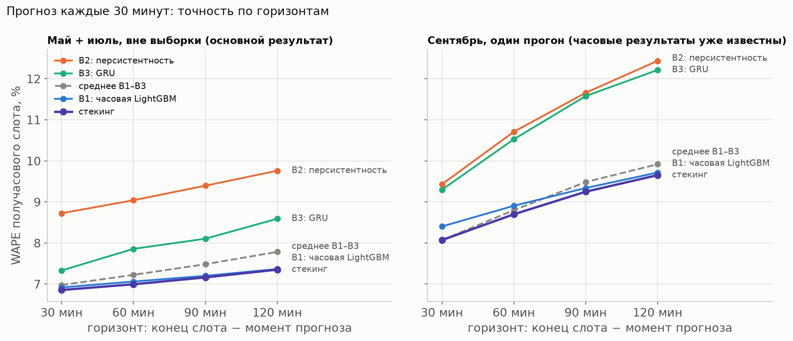
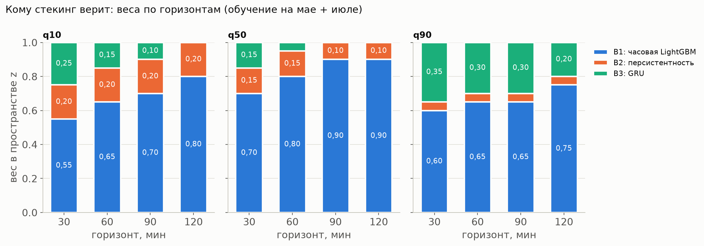
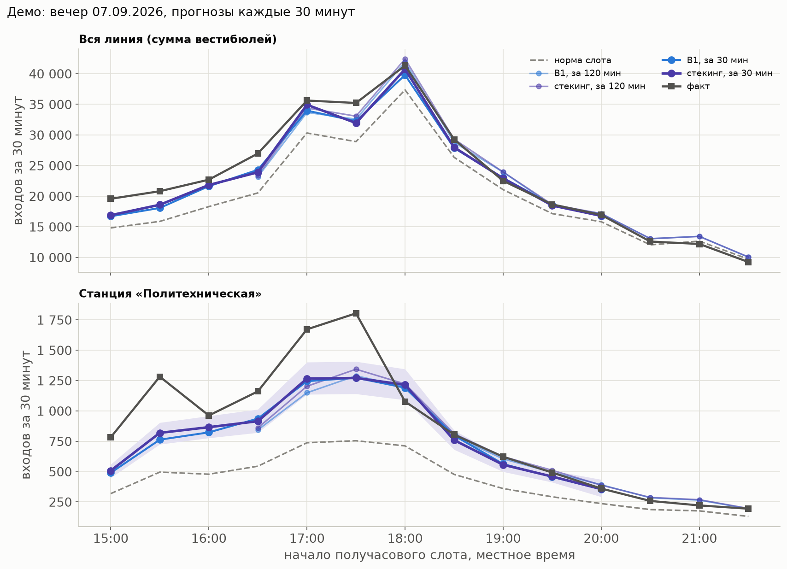

# Стекинг: прогноз каждые 30 минут

Этап 7, ч. 2. Модели: часовая LightGBM (B1), персистентность (B2) и GRU на 15-минутных рядах (B3).

**Где что лежит.**
- Код — [src/stack/](../src/stack/):
  - `data` — четверти, слоты, строки, окна;
  - `base` — B1 и B2;
  - `nn` — GRU;
  - `meta` — веса, выбор сложности, поправка;
  - `evaluate` — оценка;
  - `figures` — графики.
- Тесты — [tests/test_stack.py](../tests/test_stack.py).
- Таблицы и замороженные параметры — [reports/stack/](../reports/stack/).
- Графики — `reports/figures/spb_17_*.png`.

```bash
python -m src.stack --fit          # май и июль: базовые модели вне выборки, выбор, веса → stack_params.json, ~2 мин
python -m src.stack --september    # один прогон по замороженным параметрам, ~3 мин; повторно откажется работать
python -m src.stack --tables       # срез по минуте прогноза из кэша прогнозов
python -m src.stack --figures
python -m src.stack --train-final  # GRU на всех 15-минутных данных → models/stack_gru_final (для «сейчас» в serve)
python -m src.serve --now "2026-07-08 13:59"               # прогноз стекинга (по умолчанию)
python -m src.serve --now "2026-07-08 13:59" --model lgbm  # часовая LightGBM
```

**Ограничения этапа.**
- замороженная модель и её модули не менялись, `check_frozen` проходит;
- часовая модель только читается: бандлы `models/lgbm_fold_2026-05`, `lgbm_fold_2026-07`, `lgbm_holdout`;
- **решение команды — стекинг включён в продакшн-прогноз** `serve.forecast` по умолчанию, хотя заранее поставленное
  правило на мае не выполнено. Обоснование, компромисс и риски — в разделе 9.

## 1. Постановка

- **Момент прогноза** — t ∈ {hh:00, hh:30}, часы 06–00.
- **Цель** — входы вестибюля в четырёх получасовых слотах [t, t+30), …, [t+90, t+120);
  horizon_min = конец слота − t = 30 / 60 / 90 / 120.
- **Что известно в момент t:**
  - 15-минутные четверти с ts < t;
  - часовые данные — до последнего закрытого часа t0 = floor_hour(t) − 1 ч. В hh:30 час hh ещё не закрыт,
    поэтому t0 тот же, что в hh:00.
- **Истина** — сумма двух четвертей 15-минутного источника.
- **Норма слота** n — b4 · s_v · доля половины часа, всё по прошлому (этап 6):
  - b4 — замороженная норма часа;
  - s_v — поправка источника за 14 прошлых суток;
  - доля половины часа — из профиля по суткам строго до D.
- **Цель моделей** — z = log((y + 1)/(n + 1)), как у часовой модели; вес — n.
- **Строки** — вестибюль × t × слот, если час слота проходит отбор этапа 6: обычные сутки с 09.02, без флагов,
  `is_source_mismatch` и `is_slot_closed`, in_hourly, b4 ≥ 20. Всего 337 284 строки:
  - февраль — 61 360, они нужны только для обучения GRU и квантилей B2;
  - май — 84 228;
  - июль — 100 891;
  - сентябрь — 90 805.
- **Срезы:**
  - все слоты;
  - пики — час слота 07–09 или 17–19;
  - аномальные — час слота аномален по истине этапа 6.

## 2. Базовые модели

У каждой модели на выходе q10, q50, q90 в пространстве z.

**B1 — часовая LightGBM вне выборки:**
- **какая модель для какого месяца:** май — фолд мая, июль — фолд июля, сентябрь — `lgbm_holdout`.
  У каждой модели train_end + 7 суток раньше начала месяца, это проверяется в коде;
- **перевод в слот:** прогноз часа H с t0 → ŷ_H · s_v · доля половины;
- **горизонт часовой модели:**
  - в :00 — h = 1, 1, 2, 2 для четырёх слотов;
  - в :30 — h = 1, 2, 2, 3.

  h = 3 нужен для слота [hh+2:00, hh+2:30), до которого прогноз, сделанный в hh:00, не дотягивается (решение
  пользователя). Признаки строки h = 3 считает замороженный `features.py` по данным до t0. Модель учили только
  на h = 1, 2, поэтому деревья относят h = 3 к ветке h = 2;
- **сверка:** прогнозы h = 1 совпадают с `nowcast.model_oos` до последнего знака.

**B2 — персистентность:**
- r̂ = Σy / Σнорма за две последние четверти [t − 30, t), clip [0,3; 3];
- q50 = log((n · r̂ + 1)/(n + 1));
- q10 и q90 — квантили остатка на месяцах обучения по ячейке «горизонт × период суток».

**B3 — GRU на PyTorch:**
- **вход:**
  - 16 четвертей (4 ч) log-отклонения от нормы с флагами пропусков;
  - отклонение всей линии за те же четверти;
  - эмбеддинги вестибюля, четверти суток, дня недели и типа дня;
- **выход:** 4 горизонта × 3 квантиля, q10 = q50 − softplus, q90 = q50 + softplus;
- **потери:** pinball с весом n.

*Почему GRU, а не 1D-CNN.*
- Окно короткое, поэтому скорость не важна.
- Главное в данных — затухание отклонения, r держится 2–3 часа. Рекуррентное состояние учит его напрямую.
- Ночные и закрытые четверти GRU пропускает через флаги и ворота. Свёртка смешивала бы их с данными на тех же
  смещениях.
- На CPU GRU детерминирована.

*Как обучается:*
- **окна** расширяются: фев → май, фев + май → июль, фев + май + июль → сентябрь;
- **ранняя остановка** — по последним 7 суткам обучения, затем дообучение на всём окне с тем же числом эпох;
- **стандартизация** — по обучению;
- **seed** — 3, z усредняются;
- **устройство** — CPU, один поток, прогнозы побитово воспроизводятся;
- **время** — от 0,5 до 3 минут на окно.

| Окно → тест | Моментов в обучении | Эпохи по seed |
|---|---|---|
| фев → май | 16 029 | 27, 23, 8 |
| фев + май → июль | 37 993 | 18, 15, 30 |
| фев + май + июль → сентябрь | 64 331 | 53, 51, 17 |

**Окна не пересекают разрывы между месяцами.** Окно собирается по меткам времени и допустимо, только если
[t − 4 ч, t) лежит внутри блока своего месяца. Это проверяет тест.

**Простое среднее** — среднее z трёх моделей по каждому квантилю.

## 3. Мета-модель

**Вход** — только прогнозы вне выборки за май и июль. Февраля в стекинге нет: на нём обучались часовые фолды.
Сентябрь — проверка после заморозки параметров.

**Веса.** Для каждого квантиля и ячейки w ≥ 0, Σw = 1. Подбор — минимум взвешенного pinball в z на сетке
по симплексу с шагом 0,05. Квантили после смешивания сортируются.

**Выбор сложности:** обучение на мае → проверка на июле и наоборот; метрика — средний взвешенный pinball в z.

| Вариант ячеек | май → июль | июль → май |
|---|---|---|
| V1: горизонт | 0,02266 | **0,02336** |
| V2: горизонт × период суток | **0,02262** | 0,02348 |
| V3: горизонт × минута прогноза (:00 / :30) | 0,02265 | 0,02336 |

Ни один вариант не лучший в обоих направлениях, поэтому по правилу взят V1. Различия — в пятом знаке. V3 добавлен
сверх ТЗ: в :30 прогноз B1 на 30 минут старее, а на горизонте 120 работает с h = 3. Однако и он не обогнал V1.

**Интервал.** Асимметричная конформная поправка в z по ячейкам «горизонт × период суток» считается по последнему
месяцу обучения стекинга:
- май → июль — по маю;
- июль → май — по июлю;
- сентябрь — по июлю.

Параметры заморожены в `stack_params.json` (sha256) до прогона сентября.

## 4. Результат: май ↔ июль — основной



Май предсказан стекингом, обученным на июле, июль — обученным на мае. Всё вне выборки, 185 119 строк, 57 суток.

| Модель | 30 мин | 60 мин | 90 мин | 120 мин | Все | Пики | Аномальные | Покрытие q10–q90 | Pinball, норм. |
|---|---|---|---|---|---|---|---|---|---|
| B1: часовая LightGBM | 6,92 % | 7,06 % | 7,20 % | 7,37 % | 7,13 % | 6,07 % | 18,49 % | 69,3 % | 2,36 % |
| B2: персистентность | 8,72 % | 9,04 % | 9,40 % | 9,76 % | 9,22 % | 8,38 % | 17,54 % | 78,3 % | 3,10 % |
| B3: GRU | 7,33 % | 7,86 % | 8,10 % | 8,59 % | 7,96 % | 6,91 % | 21,04 % | 66,7 % | 2,62 % |
| Среднее B1–B3 | 6,98 % | 7,22 % | 7,48 % | 7,78 % | 7,36 % | 6,42 % | 17,92 % | 77,3 % | 2,40 % |
| **Стекинг** | **6,85 %** | **6,99 %** | **7,16 %** | **7,35 %** | **7,09 %** | 6,07 % | 17,93 % | **78,5 %** | **2,34 %** |

**ΔWAPE стекинга к B1**, п. п. [95 % ДИ]. B1 — лучшая базовая модель на каждом горизонте и в каждом месяце,
поэтому сравнения «к B1» и «к лучшей базовой» совпадают. ДИ — блочный бутстреп по суткам, p — тест Диболда–Мариано.

| Горизонт | май + июль | май (обучен на июле) | июль (обучен на мае) |
|---|---|---|---|
| 30 мин | +0,06 [+0,02; +0,11] | +0,06 [−0,00; +0,15] | +0,06 [+0,01; +0,11] |
| 60 мин | +0,07 [+0,03; +0,11] | +0,05 [−0,02; +0,15] | +0,08 [+0,06; +0,11] |
| 90 мин | +0,04 [+0,02; +0,06] | +0,03 [−0,01; +0,07] | +0,05 [+0,03; +0,07] |
| 120 мин | +0,02 [+0,00; +0,03] | +0,02 [−0,00; +0,04] | +0,01 [−0,01; +0,03] |
| **все** | **+0,05 [+0,02; +0,08], p < 0,001** | +0,04 [−0,00; +0,10], p = 0,017 | +0,05 [+0,03; +0,08], p < 0,001 |
| пики | +0,00 [−0,02; +0,03] | +0,00 [−0,04; +0,06] | +0,01 [−0,02; +0,03] |
| аномальные | **+0,56 [+0,37; +0,75]** | +0,79 [+0,44; +1,06] | +0,38 [+0,27; +0,50] |

**Что видно:**
- **Стекинг точнее B1, но ненамного:** +0,05 п. п. по всем слотам. Выигрыш больше на коротких горизонтах
  (+0,06…+0,07 на 30–60 мин) и почти исчезает к 120 мин.
  - На июле выигрыш значим.
  - На мае ДИ касается нуля (нижняя граница −0,004 п. п.), хотя p DM = 0,017.
- **В пики разницы нет.**
- **В аномальных часах выигрыш в 10 раз больше** (+0,56 п. п.): 15-минутные данные показывают отклонение раньше,
  чем оно доходит до часовой модели.
- **Простое среднее хуже B1** (7,36 %): B2 и B3 по отдельности заметно слабее и тянут его вниз. Стекинг лучше среднего
  на +0,27 п. п. [+0,21; +0,33].
- **Интервал.** У B1 на слотах покрытие 69 %: его поправка откалибрована на часах, а слот шумнее. У стекинга после
  поправки — 78,5 % (74,3 % до неё), по направлениям 75,6 % и 80,9 %.

## 5. Кому модель верит — веса



Веса стекинга, обученного на мае + июле. Таблица по всем обучениям — `reports/stack/weights.csv`.

| Квантиль | B1 по горизонтам 30 / 60 / 90 / 120 | B2 | B3 |
|---|---|---|---|
| q10 | 0,55 / 0,65 / 0,70 / 0,80 | 0,20 / 0,20 / 0,20 / 0,20 | 0,25 / 0,15 / 0,10 / 0,00 |
| q50 | 0,70 / 0,80 / 0,90 / 0,90 | 0,15 / 0,15 / 0,10 / 0,10 | 0,15 / 0,05 / 0,00 / 0,00 |
| q90 | 0,60 / 0,65 / 0,65 / 0,75 | 0,05 / 0,05 / 0,05 / 0,05 | 0,35 / 0,30 / 0,30 / 0,20 |

- **Медиана — в основном часовая модель.** Чем дальше горизонт, тем больше её вес: с 0,70 до 0,90. 15-минутные модели
  получают 30 % веса на 30 минутах и 10 % на 120.
- **GRU нужна в первую очередь для хвостов:** у q90 её вес 0,20–0,35. B2 расширяет нижний край.
- **Веса устойчивы между направлениями.** Вес B1 в q50 — 0,80–0,90 при обучении на мае и 0,65–0,95 при обучении
  на июле. GRU весит больше на июле, где её обучали на двух месяцах, а не на одном феврале.

## 6. Минута прогноза: :00 и :30

`reports/stack/cross_by_minute.csv`. Строки :00 и :30 одного горизонта — это разные слоты: в :00 слот на 30 мин —
первая половина часа, в :30 — вторая.

| Горизонт | Минута | B1 | Стекинг | ΔWAPE к B1, п. п. [ДИ] |
|---|---|---|---|---|
| 30 | :00 | 6,74 % | 6,63 % | +0,10 [+0,06; +0,15] |
| 30 | :30 | 7,11 % | 7,10 % | +0,02 [−0,04; +0,08] |
| 60 | :00 | 7,11 % | 7,10 % | +0,02 [−0,02; +0,06] |
| 60 | :30 | 7,01 % | 6,90 % | +0,11 [+0,07; +0,17] |
| 90 | :00 | 7,01 % | 6,97 % | +0,05 [+0,02; +0,07] |
| 90 | :30 | 7,41 % | 7,38 % | +0,03 [+0,00; +0,06] |
| 120 | :00 | 7,41 % | 7,41 % | +0,00 [−0,01; +0,02] |
| 120 | :30 | 7,33 % | 7,30 % | +0,03 [+0,01; +0,05] |

- **Где выигрыш на мае и июле.** Он сосредоточен в слотах, которые начинаются в начале часа: 30 мин из :00, 60 мин из
  :30, 90 мин из :00. Во вторых половинах часа выигрыш в пределах шума.
- **Цена h = 3.** На горизонте 120 из :30 часовая модель прогнозирует на 3 часа. На тех же первых половинах часа с h = 2
  (90 мин из :00) у неё 7,01 %, с h = 3 — 7,33 %. Лишний час устаревания стоит около 0,3 п. п. Стекинг здесь равен B1.

## 7. Сентябрь — один прогон

Это не чистая отложенная выборка: часовые результаты по сентябрю известны по финальному тесту этапа 5. Параметры
стекинга заморожены до прогона (sha256 в `september_run.json`).
- B1 — `lgbm_holdout`;
- GRU — обучена на фев + май + июль;
- 90 805 строк, 28 суток.

| Модель | 30 мин | 60 мин | 90 мин | 120 мин | Все | Пики | Аномальные | Покрытие |
|---|---|---|---|---|---|---|---|---|
| B1: часовая LightGBM | 8,40 % | 8,91 % | 9,34 % | 9,71 % | 9,08 % | 8,43 % | 14,02 % | 64,2 % |
| B2: персистентность | 9,43 % | 10,71 % | 11,66 % | 12,44 % | 11,03 % | 10,49 % | 14,60 % | 74,3 % |
| B3: GRU | 9,30 % | 10,53 % | 11,58 % | 12,21 % | 10,88 % | 10,63 % | 19,89 % | 66,4 % |
| Среднее B1–B3 | 8,07 % | 8,80 % | 9,48 % | 9,92 % | 9,05 % | 8,32 % | 14,19 % | 74,8 % |
| **Стекинг** | **8,07 %** | **8,70 %** | **9,25 %** | **9,65 %** | **8,90 %** | **8,24 %** | **13,63 %** | 72,6 % |

**ΔWAPE к B1:**

| Горизонт | ΔWAPE, п. п. [ДИ] |
|---|---|
| 30 мин | +0,33 [+0,24; +0,43] |
| 60 мин | +0,21 [+0,14; +0,29] |
| 90 мин | +0,09 [+0,05; +0,14] |
| 120 мин | +0,06 [+0,03; +0,11] |
| **все** | **+0,18 [+0,12; +0,24], p < 0,001** |
| пики | +0,18 [+0,11; +0,28] |
| аномальные | +0,40 [+0,25; +0,56] |

- **На сдвиге уровня выигрыш втрое больше, чем на мае и июле.** В сентябре норма отстаёт от ступеньки +13,5 %,
  а свежие четверти её видят.
- **Сильнее всего — в :30 на 30 минут:** 8,38 % против 8,89 %, +0,51 п. п. [+0,39; +0,64]. Здесь даже одна
  персистентность (8,70 %) точнее часовой модели.
- **Интервал на сдвиге узковат:** 72,6 % (69,5 % до поправки). Это всё же лучше, чем у B1 на слотах (64,2 %).

## 8. Демо: вечер 07.09 (понедельник)



**Как выбран вечер.** Правило зафиксировано до прогона сентября и смотрит только на факт и норму: рабочий день
сентября с наибольшим |Σy / Σнорма − 1| линии в слотах 16:00–19:30. Это 07.09, линия на 16,2 % выше нормы.
Станция — с наибольшим отклонением в тот же вечер: «Политехническая». Начался учебный год, на станции +62 %
к уровню августа.

**Таблица** — `reports/stack/demo_0709.csv`: прогнозы каждые 30 минут из моментов 15:00…20:00, все 4 горизонта.
Ниже — WAPE по 11 слотам. На горизонте 30 это слоты 15:00–20:00, на горизонте 120 — слоты 16:30–21:30.

| Место, горизонт | Факт к норме | WAPE нормы | WAPE B1 | WAPE стекинга |
|---|---|---|---|---|
| вся линия, 30 мин | +17,5 % | 14,88 % | 6,08 % | **5,32 %** |
| вся линия, 120 мин | +12,3 % | 11,70 % | 5,30 % | **4,71 %** |
| «Политехническая», 30 мин | +103,9 % | 50,95 % | 21,37 % | **20,91 %** |

- **Линия.** Оба прогноза держат форму вечера и закрывают большую часть отклонения от нормы. Стекинг точнее B1
  на 0,6–0,8 п. п.
- **«Политехническая».** Обе модели недооценивают пик примерно на 30 %: 1 804 входа в 17:30 против ~1 270
  в прогнозе. Интервал стекинга накрыл 3 слота из 11. Это то же слабое место, что у часовой модели: норма по 4 неделям
  ещё не знает о новом семестре, а модели не переносят отклонение такого размера целиком.

## 9. Решение команды: стекинг в продакшн-прогнозе

**Что решили.** `serve.forecast(now)` по умолчанию отдаёт прогноз стекинга (`model="stack"`). Часовая LightGBM остаётся
базовой моделью внутри стекинга и запасным путём (`model="lgbm"`).

**Почему.** В среднем выигрыш мал: +0,05 п. п. [+0,02; +0,08] на мае и июле, а на мае по отдельности ДИ касается нуля
(+0,04 [−0,00; +0,10]). Но продукту важна не средняя цифра:
- **аномальные часы** — именно там решается вопрос о резерве. Здесь стекинг точнее на 0,56 п. п. [+0,37; +0,75] на мае
  и июле и на 0,40 [+0,25; +0,56] в сентябре;
- **интервал честнее:** покрытие 78,5 % против 69,3 % у LightGBM на получасовых слотах при цели 80 %.

Для решения о резерве важнее не ошибиться в необычный час и честно показать неопределённость, чем выиграть сотые доли
процента в среднем.

**Компромисс.** Решение отступает от правила, поставленного до эксперимента: подключать, только если стекинг лучше
LightGBM и на мае, и на июле (95 % ДИ выше нуля). На мае правило не выполнено. Команда приняла это осознанно. Правило
задним числом не переписывается: результаты остаются записанными как есть, а решение — продуктовое.

**Риски:**
- **средний выигрыш на новых данных может оказаться нулевым:** на мае он незначим, а сентябрь — не чистая отложенная
  выборка;
- **другой формат записей:** у стекинга получасовые слоты и горизонты 30 / 60 / 90 / 120 мин, при fallback — прежние часовые
  слоты 60 / 120. Потребителям нужно смотреть `meta["model"]` и `meta["slot_minutes"]`;
- **узкая область работы:** стекинг работает только там, где есть 15-минутные данные (февраль, май, июль, сентябрь),
  только в часы 06–00 и только в обычные сутки. Живого 15-минутного потока нет, поэтому «сейчас» пока всегда уходит в fallback;
- **мета-модель внутри выборки в мае и июле:** веса подобраны на тех же месяцах, и в meta для этих дат стоит предупреждение.
  Полностью вне выборки только сентябрь;
- **горизонт 120 мин из hh:30** — часовая модель на третий час вперёд, около 0,3 п. п. хуже, чем при h = 2;
- **причины прогноза — только от LightGBM** (GRU и персистентность объяснений не дают); флаг аномалии — по часовым порогам;
- **ответ дольше:** около 3 с при первом вызове и 0,7 с при повторном, против 2 с у LightGBM.

**Как откатить.** `serve.forecast(now, model="lgbm")` или `python -m src.serve --model lgbm`. Решение пересматриваем
на новых месяцах 15-минутных данных.

**Как устроено в serve** — [src/stack/forecast.py](../src/stack/forecast.py):
- **Момент прогноза:** t = floor_30мин(now + 1 мин). now = 08:59 → t = 09:00; последний закрытый час — тот же, что у
  часовой модели. Слоты — [t, t+30) … [t+90, t+120).
- **Только данные до now:** 15-минутные четверти с ts ≥ t — пропуск, часовые данные режутся после t0. Норма четвертей
  текущего незакрытого часа считается без флагов полного часа: они видят будущие четверти.
- **Честный выбор по дате:** LightGBM — тем же правилом, что раньше (train_end + 7 суток < now); GRU — так же среди
  `models/stack_gru_*`, иначе `stack_gru_final` с предупреждением. Веса — замороженный `reports/stack/stack_params.json`,
  хэш проверяется.
- **Fallback на LightGBM** с причиной в `meta["fallback"]`, без исключения: нет 15-минутных данных за 4 ч до t, t или все
  слоты вне 06–00, необычные сутки (праздник, событие), нет файлов стекинга, нет ни одной полной станции.
- **meta:** `model = "stack"`, базовые модели с бандлами, окнами обучения и весами по горизонтам и квантилям,
  `meta_model.out_of_sample`, `slot_minutes = 30`.
- **Проверено тестами** (`tests/test_stack_serve.py`, 19 тестов):
  - шум после now ничего не меняет;
  - fallback срабатывает в июне, 31.08, 9 мая, в 05:30 и без файлов стекинга;
  - выход проходит контракт, 18 станций × 4 горизонта;
  - z базовых моделей и стекинга совпадают с исследованием до 1e-6.

## Решения

1. **Стекинг включён в продакшн-прогноз** по решению команды, хотя правило «лучше B1 на мае и на июле» на мае
   не выполнено (ДИ [−0,00; +0,10]). Обоснование, компромисс и риски — в разделе 9.
2. **Вариант весов — V1 (по горизонту).** По правилу «лучший в обоих направлениях»; более сложные варианты
   не обгоняют его ни в одном направлении больше чем в пятом знаке pinball.
3. **B4 (LightGBM на 15-минутных признаках) не делали** — решение пользователя. Она в улучшениях.

## Ограничения

- **B1 на горизонте 120 из :30 — экстраполяция.** Часовую модель учили на h = 1, 2; h = 3 стоит ей около 0,3 п. п.
  (раздел 6).
- **GRU учится на 1–3 месяцах.** Для мая это только февраль (16 тыс. моментов, 20 суток), поэтому её вес занижен
  именно там, где её обучали меньше всего. В сентябре GRU обучена на трёх месяцах, а веса подобраны, когда она была
  слабее.
- **Пороги аномалии и флаг в записях контракта — часовые.** Правило p80 замороженной модели применено к слоту
  как есть.
- **Интервал на сдвиге уровня** — 72,6 % в сентябре. Поправка считается по июлю.
- **Только четыре месяца 15-минутных данных.** Живого 15-минутного потока нет, поэтому прогноз каждые 30 минут
  возможен только в режиме повтора и только внутри этих месяцев; в остальное время serve отвечает часовой LightGBM.
- **Необычные сутки** (праздники, события) стекинг не видел ни в обучении, ни в оценке, поэтому в serve на них fallback.
- **Расхождение источников.** Истина слота — 15-минутный источник, он на ~1,15 % выше часового. Норма слота это
  учитывает через s_v, а прогноз часовой модели переводится в слот с тем же s_v.

## Улучшения

- **B4 — LightGBM на 15-минутных признаках** с тем же окном: последние 1–4 четверти и среднее за 4 ч в z,
  отклонение линии, час, тип дня, вестибюль.
- **Обучить часовую модель на h = 3** или ограничить горизонт 120 моментами :00.
- **Скользящая конформная поправка** по последним 4 неделям — как и для часовой модели.
- **Перепроверить решение на новых месяцах 15-минутных данных.** Выигрыш в сентябре (+0,18 п. п.) втрое больше, чем на мае
  и июле. Если в среднем он исчезнет, а в аномальных часах — нет, решение остаётся; если исчезнет и там — откат на LightGBM.

## Открытые вопросы

- **Организаторы:** будет ли живой 15-минутный поток и из какого источника — от этого зависит, можно ли вообще
  прогнозировать каждые 30 минут.
- **Роль 4:** нужен ли прогноз на получасовые слоты, или достаточно часовых с уточнением внутри часа (nowcast, ч. 1)?
